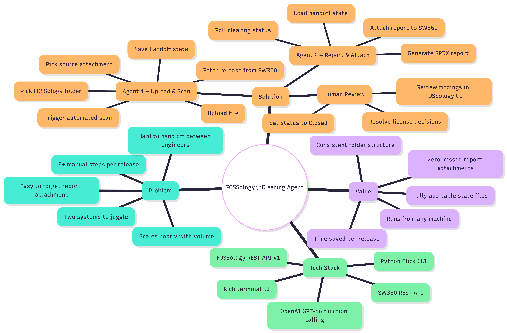
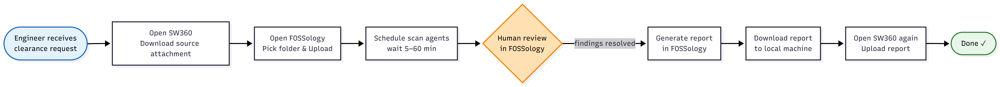
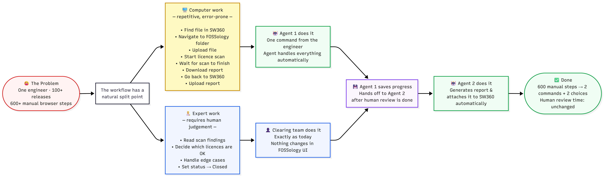
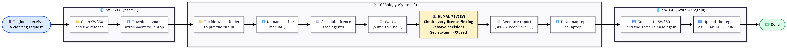
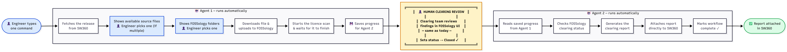
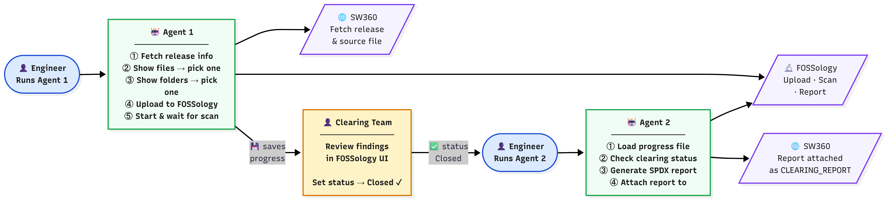
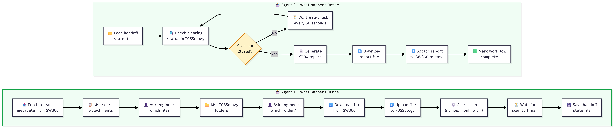
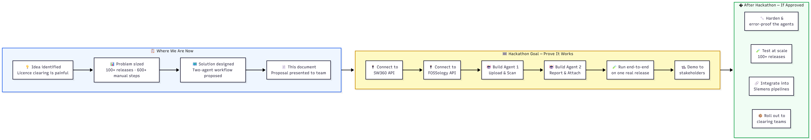
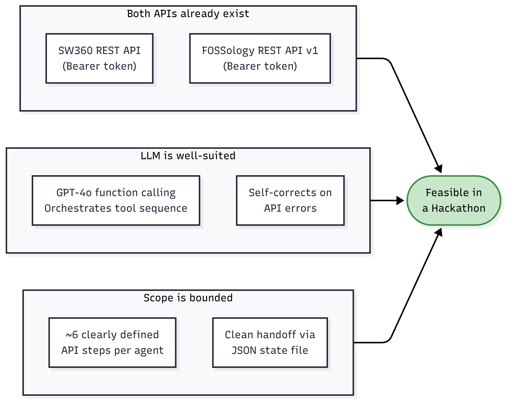

# Foss360 Clearing Agent

> **Hackathon Proposal · Siemens SW360 + FOSSology · May 2026**

---

## 📌 Problem Abstract

At Siemens, every software release containing open-source or third-party licensed components must undergo a mandatory licence clearing process. This involves two separate systems — **SW360** for component tracking and **FOSSology** for licence scanning. Today, clearing engineers perform this entirely by hand: downloading source files from SW360, navigating to the correct FOSSology folder, uploading the file, scheduling scan agents, waiting for results, generating a report, downloading it, and finally re-uploading it back to SW360. That is **7 manual browser steps per component**. For a product with 100+ components, this amounts to **600+ repetitive operations** per release cycle — roughly 75 hours of non-expert work. Steps are frequently missed, folder structures are inconsistent, and the process cannot be handed off easily between engineers. The clearing team's expertise is spent on browser navigation rather than actual licence analysis.

---

## 📌 Solution Abstract

**Foss360 Clearing Agent** is an LLM-powered two-agent system that automates the mechanical portions of the clearing workflow while keeping the human expert in full control of licence decisions. **Agent 1** runs on a single command: it fetches the release from SW360, prompts the engineer to select a source file and a FOSSology folder, then automatically uploads the file, triggers the licence scan, and waits for completion — saving a handoff state file when done. After the clearing team reviews findings in FOSSology and marks the upload as "Closed" (unchanged process), **Agent 2** picks up: it reads the state file, generates the SPDX clearing report, and attaches it directly to the SW360 release — no browser required. The result: **7 manual steps become 2 commands and 2 choices**, active effort drops from ~45 minutes to ~3 minutes per component, and reports are always attached — guaranteed.

---

## � Invention Disclosure Questionnaire

---

### 1. Which technical problem is the basis for the invention?

The core technical problem is the **absence of automated orchestration between two separate compliance systems** — SW360 (component & release lifecycle management) and FOSSology (licence scanning & report generation) — during the open-source licence clearing process.

Specifically:

- The two systems expose independent REST APIs with no native integration or data pipeline between them.
- Every clearing cycle requires a human engineer to manually act as the "middleware": downloading artefacts from SW360, uploading them to FOSSology with the correct folder context, configuring and triggering scan agents, polling for scan completion, generating a report, downloading it, and re-uploading it to SW360 as a structured attachment.
- This multi-step, cross-system workflow has **no automatic state tracking**, meaning there is no mechanism to resume interrupted workflows, hand off between engineers, or ensure all steps were completed.
- The clearing process contains a **mandatory human review step** (expert licence analysis in FOSSology) that creates a natural asynchronous break in the workflow — a break that no existing tooling handles gracefully.

The technical problem is therefore: *how to automate the deterministic, API-driven portions of a cross-system compliance workflow that contains an unavoidable human-in-the-loop step, without replacing or bypassing that human judgement.*

---

### 2. How has this problem been solved up to now?

The problem has not been solved by any dedicated technical mechanism. The current approach is:

- **Fully manual execution**: Engineers follow an informal checklist of 6–7 browser-based steps across SW360 and FOSSology for every component that requires clearing.
- **No state management**: Progress is tracked informally — in email, personal notes, or spreadsheets — with no machine-readable record of which steps have been completed.
- **No cross-system integration**: SW360 and FOSSology have no built-in data pipeline. File transfers are performed by downloading to a local machine and re-uploading through the browser UI.
- **Ad hoc scripts**: Some teams maintain isolated shell scripts to partially automate individual steps (e.g. triggering a FOSSology upload via curl), but these are not standardised, not maintained, and do not handle the full workflow or the asynchronous human review boundary.
- **No handoff mechanism**: If the engineer who started the clearing process is unavailable, work stalls — there is no state file or audit trail for another person to resume from.

In summary, the problem is currently solved by **human repetition** with all the associated risk of error, inconsistency, and lost expert time.

---

### 3. By which technical features does the invention solve the problem indicated under point 1?

The invention solves the problem through the following technical features:

**a) Two-agent architecture with a defined asynchronous boundary**
The workflow is split into two independent agents at the exact point where human judgement is required. Agent 1 handles all pre-review automation; Agent 2 handles all post-review automation. This design explicitly models the human review as a first-class workflow stage rather than an interruption.

**b) LLM-based orchestration via function-calling**
Each agent uses a large language model (GPT-4o) with a registered set of typed tool functions. The LLM decides the sequence of tool calls based on the current context and the results of prior calls. This eliminates the need for hard-coded workflow logic and allows the agent to self-correct on API errors, handle variable inputs (e.g. multiple source attachments), and adapt to edge cases without explicit branching code.

**c) Persistent JSON state file for cross-agent handoff**
After Agent 1 completes the upload and scan, it writes a structured state file (`state/<release_id>.json`) containing the upload ID, folder ID, job ID, attachment filename, and release metadata. Agent 2 reads this file to resume the workflow deterministically — enabling handoff between engineers, machines, or time periods without any shared session or database.

**d) Clearing status polling against the FOSSology REST API**
Agent 2 polls `GET /uploads/{upload_id}` on the FOSSology API and reads the `clearingStatus` field. It proceeds only when the value is `"closed"`, enforcing that the human review has been completed before any report is generated. An optional `--wait` flag enables fully unattended overnight operation.

**e) Automated SPDX report generation and structured SW360 attachment**
Agent 2 calls `POST /report` on the FOSSology API to generate an SPDX2 clearing report, polls until the report is ready, downloads the binary, and attaches it to the SW360 release via `POST /releases/{id}/attachments` with the correct `CLEARING_REPORT` attachment type — eliminating the final manual step that is most frequently forgotten.

---

### 4. What are the main differences between your invention and the known solutions/products?

| Dimension | Known Approaches | Foss360 Clearing Agent |
|---|---|---|
| **Workflow coverage** | Individual API scripts covering one step at a time | End-to-end automation of the full clearing cycle across both systems |
| **Human review handling** | Ignored — scripts either block waiting or skip it entirely | Explicitly modelled as an asynchronous boundary between two independent agents |
| **State management** | None — progress exists only in the engineer's memory | Persistent JSON state file enabling resume, handoff, and audit |
| **Orchestration model** | Hard-coded sequential script logic | LLM function-calling — adaptive, self-correcting, extensible |
| **Cross-system integration** | Manual file transfer via browser UI | Direct API-to-API transfer: SW360 download → FOSSology upload, FOSSology report → SW360 attachment |
| **Completion guarantee** | Report attachment frequently forgotten | Report attachment is the final automated step — cannot be skipped |
| **Scalability** | Effort grows linearly with component count | Near-constant human effort regardless of component volume |
| **Standardisation** | Varies by engineer and team | Identical scan agent configuration and folder structure for every clearing |

No existing Siemens-internal or open-source tool was identified that combines LLM-based cross-system orchestration with explicit human-in-the-loop state management for the FOSSology–SW360 clearing workflow.

---

### 5. Detection

The invention is **detectable by use**. Specifically:

- The structured state files (`state/<release_id>.json`) written by Agent 1 are human-readable artefacts that record the automated workflow execution with timestamps.
- The `CLEARING_REPORT` attachment created in SW360 by Agent 2 is identifiable by its attachment type and can be traced back to automated generation via FOSSology report metadata embedded in the file.
- FOSSology server logs record the upload, job scheduling, and report generation API calls, which are distinguishable from browser-initiated actions by their programmatic request patterns and user-agent headers.
- SW360 audit logs record the attachment creation event with the API token identity used by the agent.

Detection is therefore possible through artefact inspection (state files, attachment metadata) and server-side API access logs.

---

### 6. Invention Disclosures or Closely Related Siemens Patent Applications

To the best of the inventors' knowledge at the time of this disclosure:

- No prior Siemens invention disclosure specifically covering **LLM-orchestrated two-agent automation of the FOSSology–SW360 licence clearing workflow** has been identified.
- No Siemens patent application covering the specific combination of: (a) LLM function-calling for compliance workflow orchestration, (b) asynchronous human-in-the-loop state handoff via JSON state files, and (c) automated cross-system SPDX report generation and attachment, has been identified in publicly available Siemens patent databases.
- Related general areas (OSS compliance tooling, SW360 extensions, FOSSology integrations) should be searched by the patent department prior to filing to confirm novelty.

> *This section should be reviewed and confirmed by the Siemens IP/Patent department before formal submission.*

---


Open-source license clearing is a **mandatory compliance step** at Siemens for every software release. SW360 is the central system for tracking **all software components** — whether open-source, proprietary, first-party internal libraries, or reused internal modules. For any component that includes open-source or third-party licensed code, a clearing process is required to verify licence obligations before the software can ship.

Today, this clearing process requires engineers to manually coordinate across two separate systems — **SW360** (component & release tracking) and **FOSSology** (licence scanning & report generation) — for every component that needs clearing.

This project introduces an **LLM-powered two-agent system** called **Foss360 Clearing Agent** that automates the repetitive, error-prone portions of that workflow, while keeping the human expert firmly in control of the actual licence review decisions.

---

## 🗺️ Idea Mind Map



---

## ❓ Why This Matters — The Problem



### What the team does today

```
1.  Open SW360
    └── Navigate to the release
    └── Find the correct source attachment
    └── Download it to your local machine

2.  Open FOSSology
    └── Decide which folder to put the upload in
    └── Upload the downloaded file
    └── Wait for the upload to process

3.  Schedule scan agents (nomos, monk, ojo, …)
    └── Wait — this can take minutes to an hour

4.  ── HUMAN CLEARING REVIEW ──────────────────────────────
    The clearing team reviews scan findings in FOSSology,
    resolves all license decisions, and manually sets the
    upload status to "Closed" when done.
    ──────────────────────────────────────────────────────

5.  Go to Reports → generate a report (SPDX, ReadmeOSS, etc.)
    └── Wait for the report to be generated
    └── Download the report file to your machine

6.  Go back to SW360
    └── Navigate to the same release again
    └── Upload the report as a CLEARING_REPORT attachment
```

### Why this is painful

| Pain point | Impact |
|---|---|
| **6+ manual browser steps** across 2 systems | High effort per release |
| **No standard folder naming** in FOSSology | Uploads go to wrong folders; hard to audit |
| **Easy to forget step 6** (attaching the report back) | Clearing stays marked incomplete in SW360 |
| **Hard to hand off** mid-process | If the person who started it is away, work stalls |
| **Scales very poorly** | One engineer clearing **100+ releases = 600+ manual steps** — weeks of repetitive work |

> 💡 **Real-world scale:** A typical Siemens product release cycle can involve **100+ third-party components**, each requiring its own clearing. At 6 manual steps each, that is **600+ browser operations** — done by hand, one by one, for every release cycle.

---

## 🎯 Core Idea — What It Solves

> The core idea is simple: **let a computer do the computer work, so the expert can do the expert work.**



The agents act as a **smart wrapper** around both systems. They do the tedious navigation, file transfers, and waiting — leaving only the intellectually meaningful work (reviewing licence findings) to the human expert.

---

## 🔄 Before & After — The Full Picture

> These diagrams show what the clearing process looks like **without** the agent (today) and **with** the agent.

### ❌ BEFORE — The Manual Way (Today)



> **Result today:** 6+ manual steps, switching between two systems, downloading/uploading files by hand, and easy to forget the final report attachment step.

### ✅ AFTER — With the Two-Agent System



> **Result with agents:** The engineer types **2 commands** and answers **2 questions**. Everything else is done automatically. The clearing review in FOSSology is **completely unchanged**.

### 📊 Side-by-Side at a Glance

| Step | ❌ Manual Today | ✅ With Foss360 Agent |
|------|----------------|----------------------|
| **1** | Open SW360 → find the release | `python main.py upload` — agent does it |
| **2** | Download source file to laptop | Agent downloads automatically |
| **3** | Open FOSSology → pick folder → upload | Agent asks you to pick from a list |
| **4** | Start scan → wait up to 1 hour | Agent starts & waits automatically |
| **5** | 👤 Review findings & set Closed | 👤 Same as today — unchanged |
| **6** | Generate report → download to laptop | `python main.py report` — agent does it |
| **7** | Open SW360 again → upload report | Agent attaches directly — no browser needed |

---

## 🏢 Value for Siemens

| Metric | 🔴 Without Agent | 🟢 With Foss360 Agent | 💡 Impact |
|---|---|---|---|
| ⏱️ **Active effort per release** | ~45 min | ~3 min | **93% time saved** |
| 📦 **100 releases total** | ~75 hours of browser clicking | ~5 hours (human review only) | **70 hours freed up** |
| 🔒 **Report always in SW360** | ❌ Depends on person remembering | ✅ Guaranteed every time | Zero compliance gaps |
| 🔁 **Consistent scan setup** | ❌ Varies by engineer | ✅ Same standard setup always | Reliable audit trail |
| 📋 **Handoff between engineers** | ❌ Knowledge in one person's head | ✅ State file anyone can resume | No work blocked by absence |
| 🧑‍🔬 **Expert time spent on** | Clicking browsers | Reviewing licence findings | Higher quality decisions |
| 🔢 **Steps required** | 6+ manual browser steps | 2 commands + 2 choices | Simpler for everyone |
| 📈 **Scales with volume** | Effort grows linearly | Near-flat effort increase | Ready for 1000+ releases |

---


## 📐 Proposal Overview — Solution Approach

### The Big Picture — How the Three Pieces Connect



### What Each Agent Does — Block View



The approach splits at the **natural human boundary**:

- 🤖 **Agent 1** automates everything before the human review — upload, scan, wait.
- 👤 **Clearing team** reviews findings in FOSSology exactly as today.
- 🤖 **Agent 2** automates everything after — report generation and SW360 attachment.

### The Two-Agent Workflow in Detail

The agents split the work at the natural breakpoint — the **human clearing review in FOSSology**. Everything before that review is automated by Agent 1. Everything after is automated by Agent 2.

```
┌──────────────────────────────────────────────────────────────────────┐
│  AGENT 1  (python main.py upload --release-id <ID>)                  │
│                                                                      │
│  • Fetches the release from SW360                                    │
│  • Shows source attachments → user picks one (if multiple)           │
│  • Shows FOSSology folders  → user picks one (or creates new)        │
│  • Downloads the file from SW360 and uploads it to FOSSology         │
│  • Triggers the automated license scan and waits for it to finish    │
│  • Saves a handoff state file for Agent 2                            │
└──────────────────────────────────────────────────────────────────────┘
                              │
              ╔═══════════════▼══════════════════╗
              ║   HUMAN CLEARING REVIEW          ║
              ║                                  ║
              ║  Clearing team reviews findings  ║
              ║  in FOSSology UI, resolves all   ║
              ║  license decisions, then sets    ║
              ║  the upload status → "Closed"    ║
              ╚═══════════════╤══════════════════╝
                              │
┌──────────────────────────────────────────────────────────────────────┐
│  AGENT 2  (python main.py report --release-id <ID>)                  │
│                                                                      │
│  • Reads the handoff state saved by Agent 1                          │
│  • Checks FOSSology upload clearing status                           │
│  • Waits if not "Closed" yet (with --wait flag)                      │
│  • Generates the SPDX2 clearing report                               │
│  • Downloads the report                                              │
│  • Attaches the report to the SW360 release as CLEARING_REPORT       │
└──────────────────────────────────────────────────────────────────────┘
```

The team member is only asked **two questions** (both in Agent 1):
1. **Which source attachment** to send — only if there are multiple.
2. **Which FOSSology folder** to upload into — picked from a live list.

---

## 🏁 Hackathon Scope

> 💡 **This is a proposal idea. No technical work has been started yet.** The hackathon goal is to validate the concept, agree on the approach, and define a clear plan that a team can execute.



**What this proposal asks for (Hackathon):**

| # | Goal | Status |
|---|---|---|
| 1 | Connect to SW360 REST API and read release data | 🔲 Not started |
| 2 | Connect to FOSSology REST API and upload a file | 🔲 Not started |
| 3 | Build Agent 1 — automate upload & scan | 🔲 Not started |
| 4 | Build Agent 2 — automate report & SW360 attachment | 🔲 Not started |
| 5 | Run the full workflow end-to-end on one real release | 🔲 Not started |
| 6 | Demo the result to the clearing team | 🔲 Not started |

**What is explicitly NOT in scope for the hackathon:**
- ❌ Production hardening or large-scale testing
- ❌ Integration into CI/CD pipelines
- ❌ Any changes to FOSSology UI or SW360 UI
- ❌ Automated licence decision suggestions — human review stays unchanged

---

## ✅ Why This Is Feasible



| Factor | Evidence |
|---|---|
| **Both REST APIs are documented** | SW360 Swagger UI · FOSSology `/api/v1` OpenAPI |
| **Auth is simple** | Bearer tokens in `config.yaml` — no OAuth dance needed |
| **LLM tool-calling is mature** | GPT-4o function calling handles multi-step workflows reliably |
| **Each agent has ≤ 8 tools** | Small enough to fit in context; easy to reason about |
| **State handoff is trivial** | A JSON file with 6 fields — no database needed |
| **Human review is preserved** | No need to change FOSSology's clearing UI at all |

---

## ❓ Q&A

**Q: Why two agents instead of one?**
The human clearing review is a real break in the workflow — it can take minutes, hours, or days. Two agents let each half run independently without holding a process open waiting for a human.

**Q: Why use an LLM at all — couldn't this just be a script?**
A plain script would need hard-coded logic for every edge case (multiple attachments, folder creation, retry on scan failure, etc.). The LLM orchestration layer handles these naturally through tool-calling, and is much easier to extend.

**Q: What data does the LLM see?**
Only the structured JSON tool responses (release metadata, folder lists, job status). File contents are never sent to the LLM.

**Q: What if the OpenAI API is unavailable?**
Both agents fail fast with a clear error. The state file is not corrupted. You can re-run either agent once connectivity is restored.

**Q: Is the clearing review in FOSSology changed at all?**
No. The clearing team uses FOSSology exactly as they do today. The only difference is they don't need to do any SW360 navigation before or after.


---
