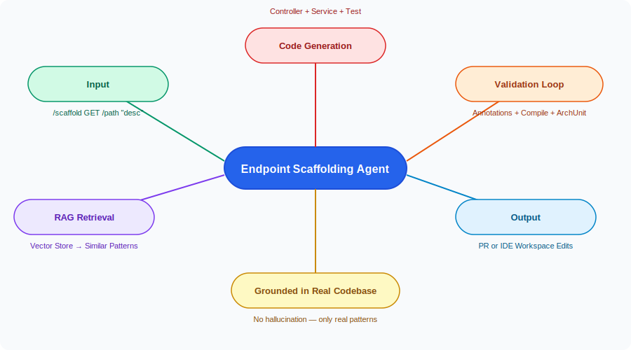
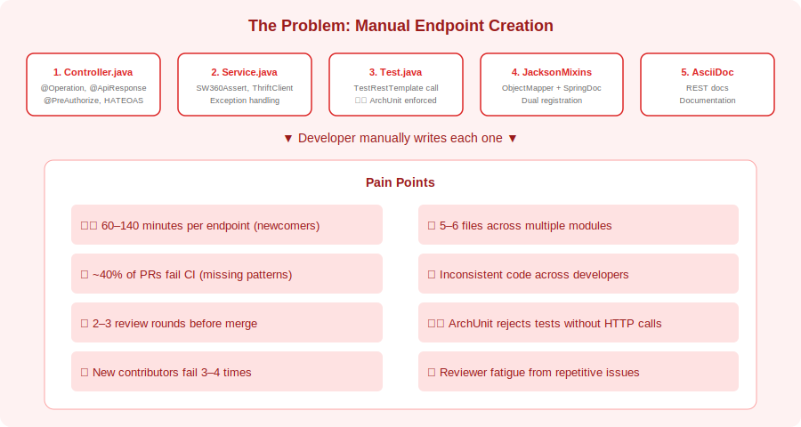
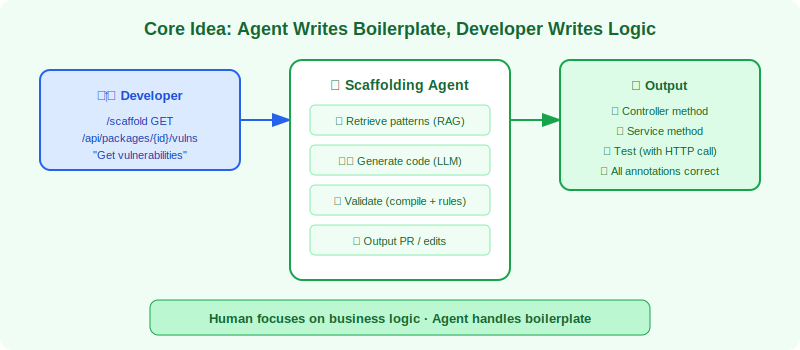
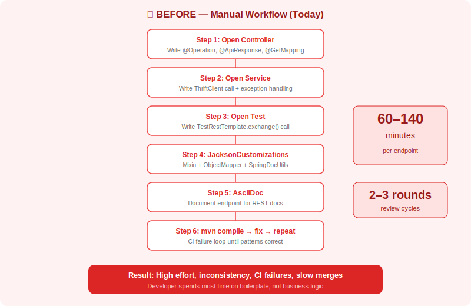
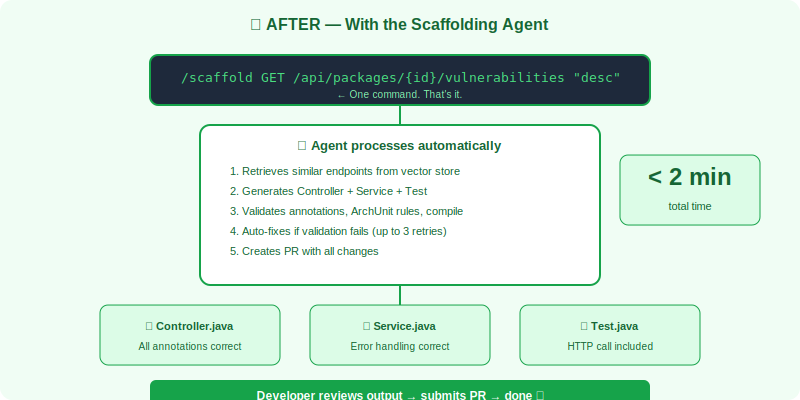
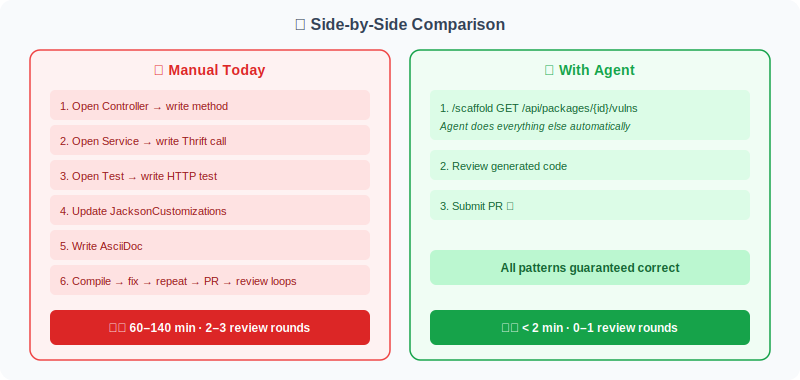
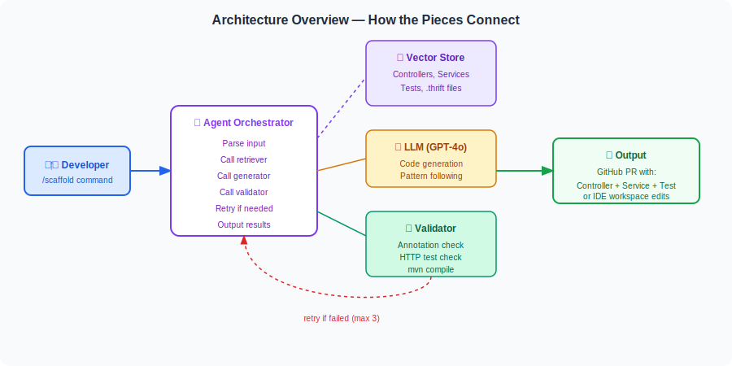
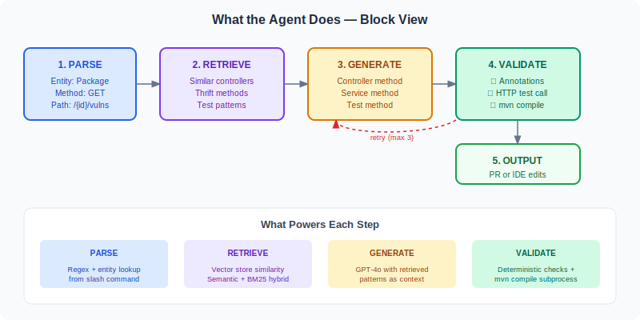
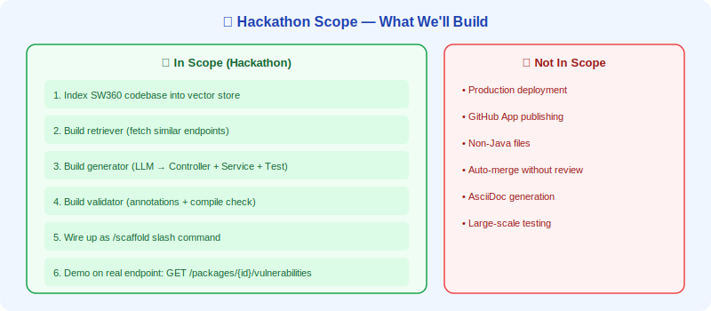
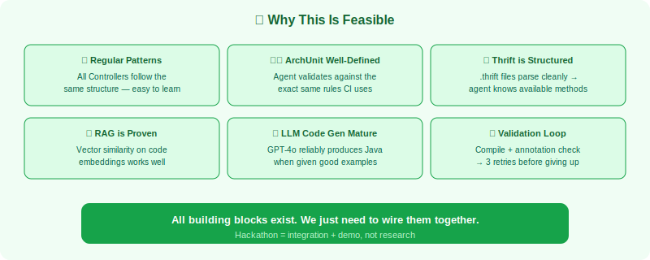

# Endpoint Scaffolding Agent

> **Hackathon Proposal · Siemens SW360 · May 2026**

---
## 📌 Idea Title

**RAG-Powered REST Endpoint Scaffolding Agent for SW360**

---

## 👥 Hackathon/Event Team Name

**Team ScaffoldX**

---
## � Problem Abstract

Adding a new REST endpoint to SW360 is a multi-file, multi-layer task requiring changes across 5-6 files — Controllers, Services, Tests, Jackson mixins, and documentation — each with strict patterns enforced by ArchUnit rules at build time. Developers (especially new contributors) spend **60-140 minutes per endpoint** manually writing boilerplate code, only to have CI reject it because a test doesn't call `TestRestTemplate`, an `@Operation` annotation is missing, or error handling doesn't follow the SW360 pattern. With 50+ REST endpoints across 10+ entities and 40+ contributors of varying experience, every sprint's 2-3 new endpoints result in **inconsistency, review churn, and frustrated newcomers**. The patterns are well-defined but tedious to replicate manually, leading to 40% CI failure rates on first submission and 2-3 review rounds before patterns are correct.

---

## 📌 Solution Abstract

**Endpoint Scaffolding Agent** is a RAG-powered code generator that retrieves patterns from the actual SW360 codebase via a vector store, then generates all required code in one shot — Controller method, Service method, and HTTP-exercising Test — validated against ArchUnit rules before output. The agent parses a simple command (e.g., `/scaffold GET /api/packages/{id}/vulns`), retrieves the 3 most similar existing endpoints as patterns, and uses an LLM to produce code following those exact conventions. A validation loop checks syntax, required annotations, HTTP test presence, and runs `mvn compile` — with up to 3 automatic retries on failure. The result: **5-6 manual files and 60-140 minutes become 1 command and <2 minutes**, with pattern-correct code from the start. New contributors' first PRs are correct, review rounds drop from 2-3 to 0-1, and developers focus on business logic instead of boilerplate.

---

## 📋 Invention Disclosure Questionnaire

---

### 1. Which technical problem is the basis for the invention?

The core technical problem is the **absence of automated, pattern-aware code generation** for multi-layer REST endpoint scaffolding in a complex enterprise Java codebase with strict architectural constraints.

Specifically:

- Adding a single REST endpoint in SW360 requires coordinated modifications across 5-6 files: Controller, Service, Test, optionally Jackson mixins, and documentation — each with specific structural and annotation requirements.
- The codebase enforces patterns via ArchUnit rules at build time (e.g., tests must make actual HTTP calls via `TestRestTemplate`, not mock the controller directly), but these rules only report failures after manual coding is complete.
- Patterns vary subtly by HTTP method (GET vs POST), return type (single vs paginated list), and entity type — requiring developers to find and study similar existing endpoints as reference.
- New contributors face a steep learning curve (140 min vs 60 min for experienced developers) because there is no single source of truth for "how to add an endpoint correctly."

The technical problem is therefore: *how to automatically generate structurally-correct, pattern-compliant, multi-file REST endpoint code by learning from the existing codebase, while validating compliance before output.*

---

### 2. How has this problem been solved up to now?

The problem has not been solved by any dedicated technical mechanism. The current approach is:

- **Copy-paste development**: Developers find an existing endpoint that "looks similar," copy the Controller/Service/Test code, and manually adapt it — frequently missing required annotations or patterns.
- **Tribal knowledge**: Experienced developers know the patterns; new contributors learn through repeated CI failures and review feedback.
- **Manual code review**: Senior engineers spend significant review time catching the same mechanical pattern errors repeatedly (missing `@Operation`, wrong error handling, test not calling `TestRestTemplate`).
- **ArchUnit as a backstop**: The build fails if patterns are violated, but only after the developer has invested 60-140 minutes writing code — providing late negative feedback rather than proactive guidance.
- **No IDE templates**: Standard IDE scaffolding (e.g., Spring Initializr) generates project-level boilerplate but not application-specific endpoint patterns.

In summary, the problem is currently solved by **human imitation and trial-and-error**, with quality enforced reactively through build failures rather than proactively through generation.

---

### 3. By which technical features does the invention solve the problem indicated under point 1?

The invention solves the problem through the following technical features:

**a) RAG-based pattern retrieval from the live codebase**
The agent maintains a vector store index of all Controllers, Services, Tests, and Thrift definitions in the SW360 codebase. When scaffolding a new endpoint, it retrieves the top-3 most similar existing endpoints for the same entity using semantic similarity — ensuring generated code follows actual patterns, not hypothetical ones.

**b) LLM code generation with structured tool-calling**
A large language model (GPT-4o) receives the retrieved patterns plus explicit instruction templates. It generates: (1) the Controller method with all required annotations (`@Operation`, `@ApiResponse`, `@PreAuthorize` for writes), (2) the Service method with SW360Assert validations, Thrift client calls, and proper exception handling, and (3) the Test method with actual `TestRestTemplate.exchange()` calls per ArchUnit requirements.

**c) Compile-time validation loop with automatic retry**
Before outputting generated code, the agent attempts compilation via `mvn compile`. If compilation fails, the agent reads the error message, adjusts the generated code, and retries — up to 3 times. Only code that passes compilation is returned to the developer.

**d) Annotation and structure pre-validation**
Prior to compilation, the agent performs static checks: required annotations present, test contains HTTP call, error handling follows SW360Exception pattern. This catches obvious errors before invoking the compiler, speeding up the feedback loop.

**e) Thrift method grounding**
The agent retrieves available Thrift service methods from indexed `.thrift` files. It can only generate Service code that calls Thrift methods that actually exist — preventing hallucination of non-existent backend interfaces.

---

### 4. What are the main differences between your invention and the known solutions/products?

| Dimension | Known Approaches | Endpoint Scaffolding Agent |
|---|---|---|
| **Pattern source** | Generic templates or manual copy-paste | RAG retrieval from actual codebase — patterns are always current |
| **Multi-file coordination** | Developer manually ensures consistency | Agent generates Controller + Service + Test together as a unit |
| **ArchUnit compliance** | Discovered at build time after coding | Pre-validated before output; test always includes HTTP call |
| **Annotation completeness** | Developer memory / review catch | Agent checks @Operation, @PreAuthorize, @ApiResponse before output |
| **Thrift method validity** | Developer consults .thrift files manually | Agent retrieves indexed Thrift methods; cannot generate non-existent calls |
| **Validation loop** | Manual edit-compile-fix cycle | Automatic 3-retry compilation before output |
| **Onboarding curve** | 3-4 failed PRs before learning patterns | First PR is pattern-correct |
| **Time per endpoint** | 60-140 minutes | <2 minutes |

No existing code generation tool was identified that combines RAG-based pattern retrieval, multi-file coordinated generation, pre-output ArchUnit-aware validation, and Thrift method grounding for enterprise Java REST endpoints.

---

### 5. Detection

The invention is **detectable by use**. Specifically:

- Generated code files contain distinctive structural patterns (identical method ordering, annotation sequences, error handling blocks) that can be identified through code analysis.
- The agent can optionally add a generation metadata comment (e.g., `// Generated by Scaffolding Agent v1.0`) to produced files.
- If deployed as a GitHub slash command, the generation event is logged in the repository's comment history (`/scaffold GET /api/...`).
- The vector store index and retrieval logs record which existing endpoints were used as patterns for each generation.

Detection is therefore possible through code pattern analysis, explicit metadata, and platform-level audit logs.

---

### 6. Invention Disclosures or Closely Related Siemens Patent Applications

To the best of the inventors' knowledge at the time of this disclosure:

- No prior Siemens invention disclosure specifically covering **RAG-powered multi-file REST endpoint scaffolding with compile-time validation** has been identified.
- No Siemens patent application covering the specific combination of: (a) vector store indexing of enterprise codebase patterns, (b) LLM generation of coordinated Controller/Service/Test code, and (c) pre-output ArchUnit-aware validation with automatic retry, has been identified in publicly available Siemens patent databases.
- Related general areas (code generation, RAG systems, IDE tooling) should be searched by the patent department prior to filing to confirm novelty.

> *This section should be reviewed and confirmed by the Siemens IP/Patent department before formal submission.*

---

## �💡 Idea Introduction

Adding a new REST endpoint to SW360 is a **multi-file, multi-layer task** that touches Controllers, Services, Tests, Jackson mixins, and documentation — across 5-6 files with strict patterns enforced by ArchUnit rules at build time.

Today, developers (especially new contributors) spend **60-140 minutes per endpoint** manually writing boilerplate code, only to have CI reject it because a test doesn't call `TestRestTemplate`, or an `@Operation` annotation is missing.

This project introduces a **RAG-powered Scaffolding Agent** that retrieves patterns from the actual SW360 codebase via a vector store, then generates all required code in one shot — Controller method, Service method, and HTTP-exercising Test — validated against ArchUnit rules before output.

---

## 🗺️ Idea Mind Map



---

## ❓ Why This Matters — The Problem



### What the developer does today

```
1.  Open the Controller file
    └── Write the method with @Operation, @ApiResponse, @GetMapping/@PostMapping
    └── Add @PreAuthorize for write operations
    └── Extract the user with getSw360UserFromAuthentication()
    └── Delegate to service and wrap response in HATEOAS

2.  Open the Service file
    └── Write the method with SW360Assert validations
    └── Get ThriftClient from thriftClients.make*Client()
    └── Add try/catch for SW360Exception with errorCode mapping
    └── Return the result or throw specific REST exceptions

3.  Open the Test file
    └── Write @Test method with TestRestTemplate.exchange() call
    └── Set up mocks for Thrift client responses
    └── Assert HTTP status and response body
    └── CRITICAL: ArchUnit rejects tests without actual HTTP calls

4.  (If new fields) Open JacksonCustomizations.java
    └── Add mixin with @JsonIgnoreProperties
    └── Register with setMixInAnnotation() for serialization
    └── Register with SpringDocUtils.replaceWithClass() for OpenAPI

5.  Open AsciiDoc file
    └── Document the endpoint for REST docs

6.  Run mvn compile
    └── Fix any issues
    └── Repeat until CI passes
```

### Why this is painful

| Pain point | Impact |
|---|---|
| **5-6 files to touch** across multiple modules | High effort per endpoint |
| **ArchUnit rejects missing tests** | CI fails if test doesn't call TestRestTemplate |
| **Easy to forget annotations** | @Operation, @PreAuthorize, @ApiResponse all required |
| **Jackson mixin dual registration** | Both ObjectMapper AND SpringDocUtils must be updated |
| **Scales poorly for new contributors** | 140 min per endpoint for newcomers (vs 60 min experienced) |

> 💡 **Real-world scale:** SW360 has **50+ REST endpoints** across 10+ entities. Every sprint adds 2-3 new endpoints. With 40+ contributors of varying experience, **inconsistency and review churn** are constant problems.

---

## 🎯 Core Idea — What It Solves

> The core idea is simple: **let the agent write the boilerplate, so the developer can focus on the business logic.**



The agent acts as a **pattern-aware code generator** grounded in the actual SW360 codebase. It retrieves real examples from a vector store, generates code that follows the exact conventions, and validates everything before output — so the developer never gets rejected by ArchUnit or CI.

---

## 🔄 Before & After — The Full Picture

> These diagrams show what adding an endpoint looks like **without** the agent (today) and **with** the agent.

### ❌ BEFORE — The Manual Way (Today)



> **Result today:** 5-6 files, 60-140 minutes, 2-3 review rounds, frequent CI failures from missing annotations or tests.

### ✅ AFTER — With the Scaffolding Agent



> **Result with agent:** 1 command, <2 minutes, all files generated and validated. The developer reviews the output and submits the PR.

### 📊 Side-by-Side at a Glance



| Step | ❌ Manual Today | ✅ With Scaffolding Agent |
|------|----------------|--------------------------|
| **1** | Open Controller → write method with annotations | `/scaffold GET /api/packages/{id}/vulns` — agent does it |
| **2** | Open Service → write Thrift client call | Agent generates with correct error handling |
| **3** | Open Test → write TestRestTemplate call | Agent always includes HTTP-exercising test |
| **4** | Check JacksonCustomizations → update if needed | Agent checks indexed mixins automatically |
| **5** | Run compile → fix errors → repeat | Agent validates before output (up to 3 retries) |
| **6** | Submit PR → wait for review → fix patterns → repeat | PR is pattern-correct from the start |

---

## 🏢 Value for Siemens

| Metric | 🔴 Without Agent | 🟢 With Scaffolding Agent | 💡 Impact |
|---|---|---|---|
| ⏱️ **Time per endpoint** | 60–140 min | < 2 min | **95%+ time saved** |
| 🔁 **Review rounds** | 2–3 rounds average | 0–1 rounds (patterns already correct) | **Faster merge velocity** |
| ❌ **CI failures from patterns** | ~40% of PRs | ~0% (validated before output) | No wasted CI cycles |
| 🆕 **New contributor onboarding** | 3-4 failed PRs before learning patterns | First PR is correct | Lower friction |
| 📏 **Code consistency** | Varies by developer | Identical patterns every time | Easier maintenance |
| 🧑‍💻 **Developer focus** | Writing boilerplate | Writing business logic | Higher value work |
| 📈 **Endpoints per sprint** | 2-3 (limited by effort) | 5-10 (limited by design decisions) | Faster feature delivery |

---

## 📐 Proposal Overview — Solution Approach

### The Big Picture — How the Pieces Connect



### What the Agent Does — Block View



The approach uses **RAG (Retrieval-Augmented Generation)** to ground code generation in the actual codebase:

- 📚 **Vector Store** — indexes all Controllers, Services, Tests, Thrift files, and instructions
- 🔍 **Retriever** — fetches the 3 most similar existing endpoints as patterns
- 🤖 **Generator** — LLM produces code following retrieved patterns exactly
- ✅ **Validator** — checks syntax, annotations, HTTP test call, and compilation

### The Scaffolding Workflow in Detail

```
┌──────────────────────────────────────────────────────────────────────┐
│  SCAFFOLDING AGENT  (/scaffold GET /api/packages/{id}/vulns "desc")  │
│                                                                      │
│  1. PARSE — Extract entity, HTTP method, path, description           │
│  2. RETRIEVE — Fetch similar endpoints from vector store             │
│     • Same entity's existing Controller methods                      │
│     • Available Thrift service methods for the entity                │
│     • Test patterns for the same entity                              │
│  3. GENERATE — LLM produces:                                         │
│     • Controller method (with @Operation, @ApiResponse, etc.)        │
│     • Service method (with SW360Assert, Thrift call, error handling) │
│     • Test method (with TestRestTemplate.exchange() call)            │
│  4. VALIDATE — Check:                                                │
│     • Syntax correctness                                             │
│     • Required annotations present                                   │
│     • Test contains HTTP call (ArchUnit safe)                        │
│     • mvn compile passes                                             │
│  5. OUTPUT — PR with all changes, or workspace edits in IDE          │
└──────────────────────────────────────────────────────────────────────┘
```

---

## 🏁 Hackathon Scope

> 💡 **This is a proposal idea. No technical work has been started yet.** The hackathon goal is to validate the concept, build a working prototype, and demonstrate it on a real SW360 endpoint.



**What this proposal asks for (Hackathon):**

| # | Goal | Status |
|---|---|---|
| 1 | Index the SW360 codebase into a vector store (Controllers, Services, Tests, Thrift) | 🔲 Not started |
| 2 | Build the retriever (fetch similar endpoints by entity + method) | 🔲 Not started |
| 3 | Build the generator (LLM produces Controller + Service + Test) | 🔲 Not started |
| 4 | Build the validator (annotation check, HTTP call check, compile) | 🔲 Not started |
| 5 | Wire up as `/scaffold` slash command on GitHub | 🔲 Not started |
| 6 | Demo: scaffold a real endpoint (e.g., GET /packages/{id}/vulnerabilities) | 🔲 Not started |

**What is explicitly NOT in scope for the hackathon:**
- ❌ Production deployment or GitHub App publishing
- ❌ Support for non-Java files (Thrift generation, migrations)
- ❌ Automatic merging without human review
- ❌ Full AsciiDoc documentation generation

---

## ✅ Why This Is Feasible



| Factor | Evidence |
|---|---|
| **SW360 patterns are highly regular** | All Controllers follow the same structure; easy to learn from examples |
| **ArchUnit rules are well-defined** | Agent can validate against the exact same rules CI uses |
| **Thrift files are structured** | `.thrift` files parse cleanly → agent knows available methods |
| **RAG retrieval is proven** | Vector similarity on code embeddings works well for pattern matching |
| **LLM code generation is mature** | GPT-4o reliably produces Java code when given good examples |
| **Validation loop catches errors** | Compile check + annotation check → 3 retries before giving up |

---

## ❓ Q&A

**Q: Does the agent hallucinate Thrift methods that don't exist?**
No. The agent retrieves available Thrift service methods from the indexed `.thrift` files. It can only use methods that actually exist in the codebase.

**Q: What if my entity doesn't have a Controller yet?**
The agent will scaffold an entire new Controller class (with class-level annotations, logger, injected dependencies) plus the Service class and Test class.

**Q: What if the generated code doesn't compile?**
The agent runs `mvn compile` as a validation step. If it fails, the agent uses the error message to fix the code automatically (up to 3 retries). If still failing, it reports the issue and stops.

**Q: Can the agent handle paginated list endpoints?**
Yes. Specify `"return_type": "list"` and the agent will add `Pageable` parameter, pagination helper, and `CollectionModel` wrapping.

**Q: Does it update JacksonCustomizations.java?**
Only when new fields are exposed that aren't already covered by an existing mixin. The agent checks the indexed mixin context and suggests updates if needed.

**Q: How does it know which patterns to follow?**
The RAG retriever fetches the 3 most similar existing endpoints from the same Controller. The LLM is instructed to follow those patterns exactly.

**Q: What about @PreAuthorize — does it add it automatically?**
For POST, PUT, PATCH, DELETE endpoints: always. For GET endpoints: never. This matches the SW360 convention.

**Q: Can I run it for multiple endpoints at once?**
Not yet. Run it once per endpoint. Each generates an independent PR or set of changes.

---

