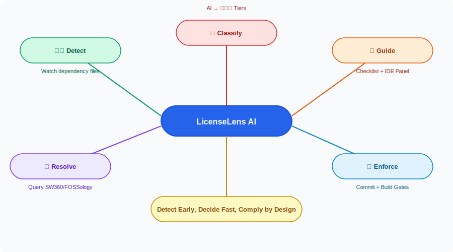
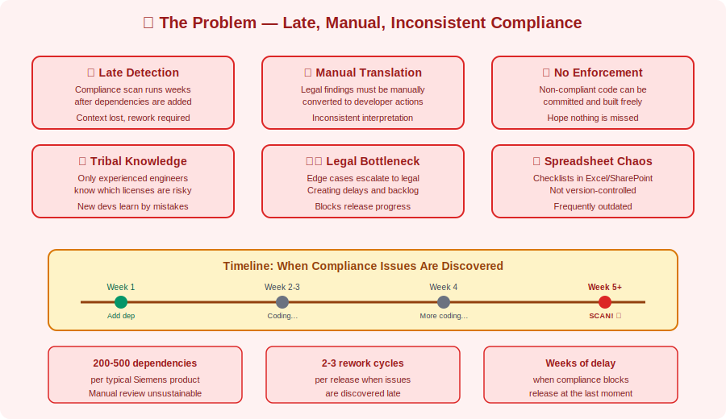
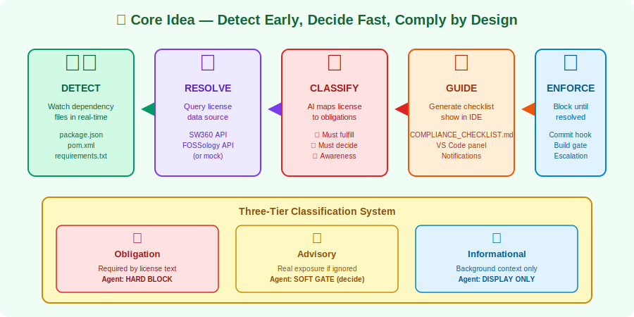
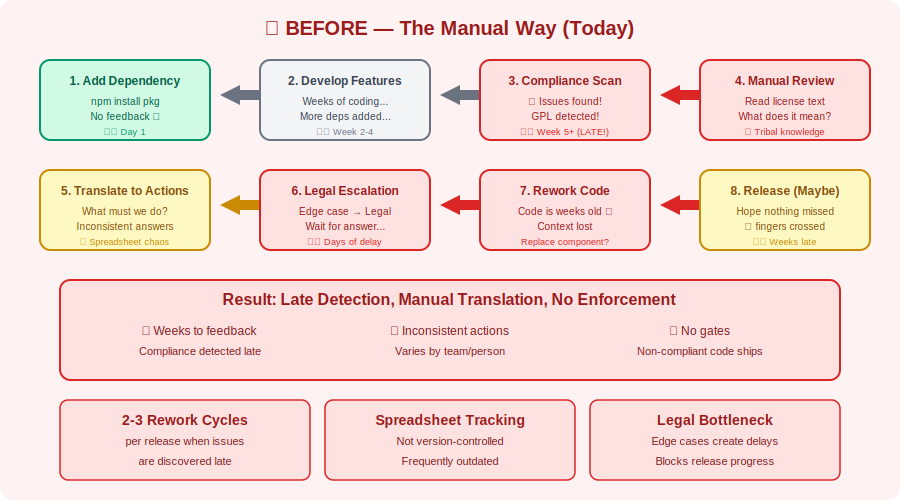
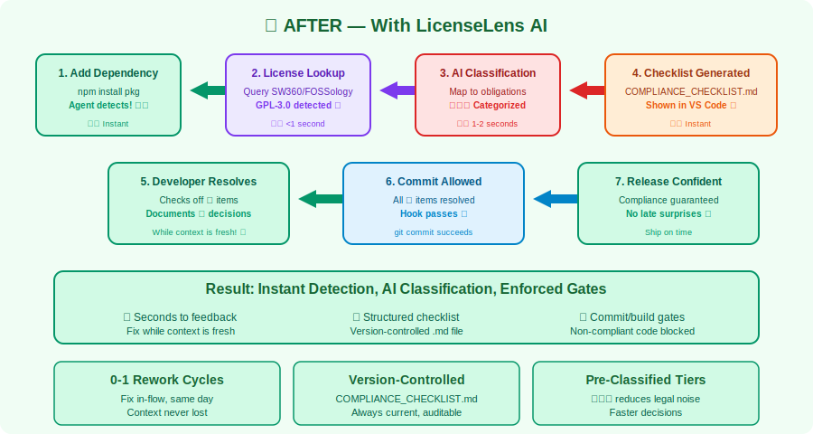
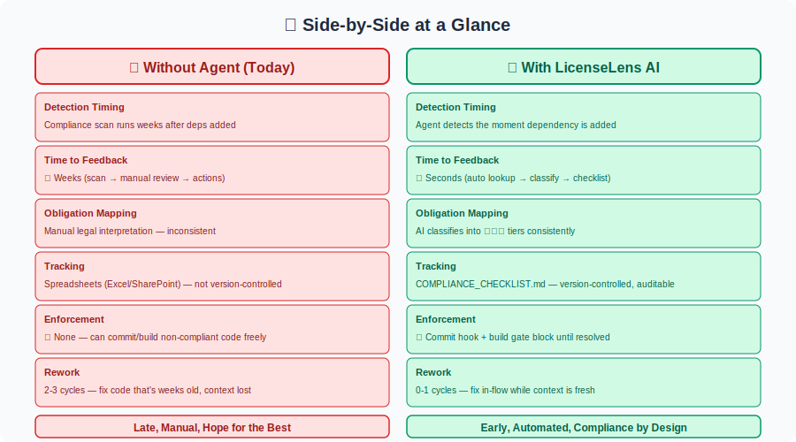
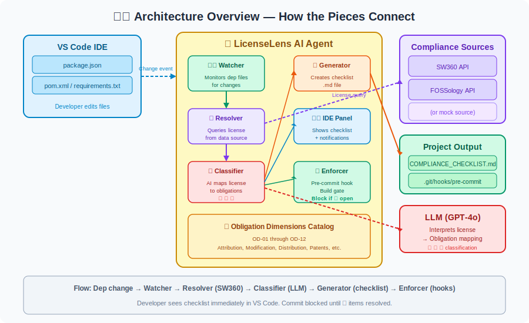
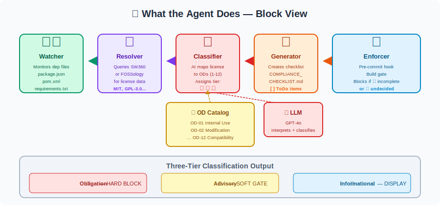
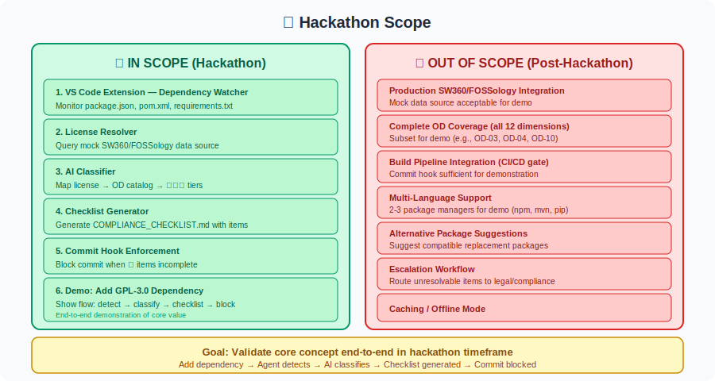
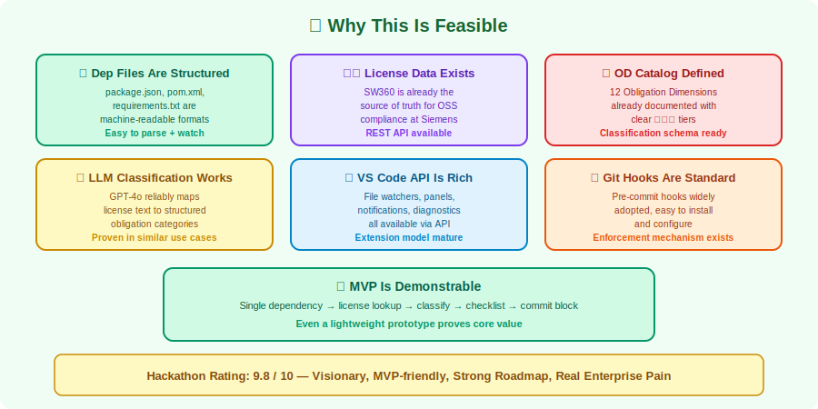

# LicenseLens AI — Compliance Guardian Agent

> **Hackathon Proposal · Siemens SW360 · May 2026**

---

## 📌 Idea Title

**LicenseLens AI: Proactive OSS License Compliance Agent for Developer IDEs**

---

## 👥 Hackathon/Event Team Name

**Team ComplianceX**

---

## 📌 Problem Abstract

At Siemens, every software product using open-source components must comply with license obligations — attribution, source disclosure, copyleft terms, and more. Today, compliance is a **late-stage audit activity**: developers add dependencies freely, then weeks later a compliance scan reveals issues that require rework, legal escalation, or even component replacement. SW360/FOSSology provides the compliance truth, but **last-mile execution inside the developer workflow is missing**. There is no in-flow guidance, no real-time detection when a problematic dependency is introduced, and no enforcement at commit/build time. Manual translation of legal findings into developer actions is inconsistent, obligation closure is frequently missed, and the same compliance issues recur across teams. The result: **delayed releases, avoidable rework, unclear ownership, and elevated legal/reputational risk** — all because compliance happens too late in the cycle.

---

## 📌 Solution Abstract

**LicenseLens AI** is an IDE-native AI agent (VS Code) that shifts compliance left by detecting dependency changes the moment they occur and converting complex license obligations into actionable developer checklists. The agent monitors dependency files (`package.json`, `pom.xml`, `requirements.txt`), queries SW360/FOSSology for license data, and uses AI to classify each obligation into three tiers: 🔴 **Obligation** (must fulfill — hard block), 🟡 **Advisory** (must decide and document — soft gate), and 🔵 **Informational** (awareness only). It generates a project-local Markdown checklist, shows guidance in the IDE, and enforces workflow gates — **blocking commit if required items are incomplete, blocking build if compliance remains unresolved**. The result: **detect early, decide fast, comply by design** — compliance becomes embedded in the developer flow, not a late external audit.

---

## 📋 Invention Disclosure Questionnaire

---

### 1. Which technical problem is the basis for the invention?

The core technical problem is the **absence of real-time, developer-integrated compliance enforcement** when open-source dependencies are introduced or changed in a software project.

Specifically:

- Compliance data exists in SW360/FOSSology, but it is not surfaced to developers at the moment they add a dependency — they learn about issues weeks later during a compliance scan.
- License obligations are expressed in legal/compliance language, not as concrete developer actions (e.g., "include NOTICE file," "add attribution to UI," "verify linking method").
- There is no automated mechanism to enforce that required obligations are fulfilled before code is committed or built — developers can unknowingly ship non-compliant code.
- Multiple obligation dimensions exist (attribution, modification rights, source disclosure, patent grants, trademark restrictions, SaaS triggers, copyleft scope) — each license activates a different subset, and mapping this manually is error-prone.
- Compliance findings are not classified by severity — developers cannot distinguish "must fix immediately" from "should document a decision" from "nice to know."

The technical problem is therefore: *how to provide instant, in-flow license obligation guidance when dependencies change, classify obligations by action severity, and enforce compliance gates at commit/build time — all within the developer's IDE.*

---

### 2. How has this problem been solved up to now?

The problem has not been solved by any integrated technical mechanism. The current approach is:

- **Late-stage compliance scans**: After development is largely complete, a scan is run (often as part of release readiness), revealing issues that require rework.
- **Manual interpretation**: Developers or compliance engineers manually read license text and translate it into required actions — inconsistently and without standardisation.
- **Spreadsheet tracking**: Compliance checklists are maintained in Excel or SharePoint, separate from the codebase, frequently outdated, and not enforced.
- **No commit/build enforcement**: Developers can commit and build non-compliant code freely — compliance catches up later (or doesn't).
- **Tribal knowledge**: Experienced engineers know which licenses are problematic; new contributors learn by making mistakes.
- **External legal review bottleneck**: Edge cases go to legal, creating delays and a backlog.

In summary, the problem is currently solved by **late manual audits and tribal knowledge**, with no in-flow detection, no automated guidance, and no enforcement at developer touchpoints.

---

### 3. By which technical features does the invention solve the problem indicated under point 1?

The invention solves the problem through the following technical features:

**a) Real-time dependency file monitoring in the IDE**
The agent watches dependency manifest files (`package.json`, `pom.xml`, `build.gradle`, `requirements.txt`, `go.mod`, etc.) and triggers compliance checks the moment a new dependency is added or a version is changed — before the developer moves on.

**b) Automated license resolution via SW360/FOSSology APIs**
For each detected dependency, the agent resolves the package name and version, then queries the compliance data source (SW360 or FOSSology, or a hackathon mock) to retrieve the applicable license(s) and any existing clearing status.

**c) AI-powered obligation mapping and classification**
The agent uses an LLM to map each license to the applicable **Obligation Dimensions** (ODs) from a master catalog covering attribution, modification, binary/source distribution, SaaS triggers, patents, trademarks, and compatibility. Each OD is classified into three tiers:
- 🔴 **Obligation** — explicitly required by the license; agent hard-blocks until resolved or escalated
- 🟡 **Advisory** — not mandated but carries real exposure; requires documented decision (accept/mitigate/escalate)
- 🔵 **Informational** — background context only; never blocks

**d) Project-local Markdown checklist generation**
The agent writes a structured checklist file (e.g., `COMPLIANCE_CHECKLIST.md`) in the project root, with checkbox items for each applicable obligation. Items are tagged 🔴/🟡/🔵 and grouped by dependency.

**e) Workflow enforcement gates**
- **IDE Integration**: The checklist and guidance are displayed inline in VS Code panels/notifications.
- **Commit Hook**: A pre-commit hook blocks commit if any 🔴 items are incomplete or if 🟡 items lack a documented decision.
- **Build Gate**: A CI/build step blocks the build if compliance-required items remain unresolved.

**f) Alternative/escalation guidance**
When an obligation cannot be met (e.g., copyleft incompatibility), the agent suggests alternative packages with compatible licenses, links to internal compliance guidance, or routes the issue to compliance review with pre-filled context.

---

### 4. What are the main differences between your invention and the known solutions/products?

| Dimension | Known Approaches | LicenseLens AI |
|---|---|---|
| **Detection timing** | Late-stage scan (weeks after coding) | Real-time (moment dependency is added) |
| **Integration point** | Separate tool/portal | Native IDE integration (VS Code) |
| **Output format** | Raw license findings | Actionable checklist with severity tiers (🔴🟡🔵) |
| **Enforcement** | Advisory reports only | Hard gates at commit and build |
| **Obligation mapping** | Manual legal interpretation | AI-powered mapping to Obligation Dimension catalog |
| **Developer guidance** | None — findings go to compliance team | In-flow guidance and alternatives shown to developer |
| **Decision tracking** | Spreadsheets, emails | Project-local Markdown checklist (version-controlled) |
| **Consistency** | Varies by person/team | Same classification logic every time |

No existing tool was identified that combines real-time IDE-native dependency monitoring, AI-powered obligation classification, three-tier severity tagging, and enforced commit/build gates for OSS license compliance.

---

### 5. Detection

The invention is **detectable by use**. Specifically:

- The compliance checklist file (`COMPLIANCE_CHECKLIST.md`) is a project artifact that can be inspected and version-controlled.
- Commit hook logs record blocked commits and the reason (incomplete 🔴 items).
- Build pipeline logs record compliance gate pass/fail status.
- The VS Code extension registers as a visible extension with identifiable telemetry (if enabled).
- SW360/FOSSology API access logs show queries originating from the agent (identifiable by user-agent or API key).

Detection is therefore possible through project artifacts, hook/build logs, and API-side audit trails.

---

### 6. Invention Disclosures or Closely Related Siemens Patent Applications

To the best of the inventors' knowledge at the time of this disclosure:

- No prior Siemens invention disclosure specifically covering **IDE-native real-time OSS license compliance enforcement with AI-powered obligation classification and commit/build gates** has been identified.
- No Siemens patent application covering the specific combination of: (a) real-time dependency file monitoring in the IDE, (b) AI-powered mapping to a three-tier Obligation Dimension catalog, (c) project-local checklist generation, and (d) enforced commit/build workflow gates, has been identified in publicly available Siemens patent databases.
- Related general areas (OSS compliance tooling, license scanning, SW360 extensions) should be searched by the patent department prior to filing to confirm novelty.

> *This section should be reviewed and confirmed by the Siemens IP/Patent department before formal submission.*

---

## 💡 Idea Introduction

> **Tagline:** Detect Early, Decide Fast, Comply by Design.

Current OSS compliance processes are **late, manual, and inconsistent**. Developers add dependencies without real-time feedback, compliance scans happen weeks later, and findings require manual translation into actions. This creates avoidable rework, delayed releases, unclear ownership, and elevated legal/reputational exposure.

**LicenseLens AI** is an IDE-native AI agent that moves compliance from a late audit activity to an **early, in-flow control point**. It converts complex legal obligations into simple developer actions and applies policy gates before risky code reaches commit or build stages.

---

## 🗺️ Idea Mind Map



---

## ❓ Why This Matters — The Problem



### What the developer does today

```
1.  Add a dependency
    └── npm install some-package / mvn add-dependency
    └── No immediate feedback on license implications
    └── Developer moves on, code evolves

2.  Weeks later — Compliance scan runs
    └── FOSSology / SW360 scan detects the dependency
    └── License obligations are identified
    └── Findings go to compliance team

3.  Compliance team interprets findings
    └── Manual review of license text
    └── "Does this require source disclosure?"
    └── "Is this compatible with our other licenses?"
    └── Translation into developer actions (inconsistent)

4.  Developer receives findings (late)
    └── Must rework code that's now weeks old
    └── Context is lost
    └── Possible component replacement needed

5.  Back-and-forth on edge cases
    └── Legal review for complex questions
    └── Delays release while waiting for decision

6.  Release (maybe)
    └── Hope nothing was missed
```

### Why this is painful

| Pain point | Impact |
|---|---|
| **Late detection** | Rework on code that's weeks old; context lost |
| **Manual translation** | Inconsistent interpretation of legal findings |
| **No enforcement** | Non-compliant code can be committed and built freely |
| **External bottleneck** | Legal review delays for edge cases |
| **Tribal knowledge** | Only experienced engineers know which licenses are risky |
| **Spreadsheet tracking** | Checklists not version-controlled, frequently outdated |

> 💡 **Real-world scale:** A typical Siemens product has **200-500 OSS dependencies**. Each has license obligations. Manual review of each is unsustainable. Compliance issues discovered late in the release cycle can delay shipment by weeks.

---

## 🎯 Core Idea — What It Solves

> The core idea is simple: **detect when the dependency is added, guide the developer immediately, enforce before commit/build.**



The agent acts as a **compliance guardian** embedded in the developer's IDE:

1. **Detect** — Watch dependency files for changes in real-time
2. **Resolve** — Query SW360/FOSSology for license data
3. **Classify** — AI maps license to Obligation Dimensions with 🔴🟡🔵 tiers
4. **Guide** — Generate actionable checklist, show in IDE
5. **Enforce** — Block commit/build until required items are resolved

---

## 🔄 Before & After — The Full Picture

> These diagrams show what compliance looks like **without** the agent (today) and **with** the agent.

### ❌ BEFORE — The Manual Way (Today)



> **Result today:** Compliance is discovered late, findings require manual interpretation, no enforcement at developer touchpoints, rework on old code, release delays.

### ✅ AFTER — With LicenseLens AI



> **Result with agent:** Instant detection, clear actionable checklist, commit/build gates prevent non-compliant code from advancing, developer handles compliance in-flow.

### 📊 Side-by-Side at a Glance



| Step | ❌ Manual Today | ✅ With LicenseLens AI |
|------|----------------|------------------------|
| **1** | Add dependency → no feedback | Add dependency → agent detects immediately |
| **2** | Compliance scan weeks later | License queried from SW360/FOSSology instantly |
| **3** | Manual interpretation of legal text | AI classifies into 🔴🟡🔵 tiers automatically |
| **4** | Inconsistent translation to actions | Structured checklist generated in project |
| **5** | Can commit/build non-compliant code | Commit/build blocked until 🔴 items resolved |
| **6** | Late rework on old code | Fix immediately while context is fresh |

---

## 🏢 Value for Siemens

| Metric | 🔴 Without Agent | 🟢 With LicenseLens AI | 💡 Impact |
|---|---|---|---|
| ⏱️ **Time to compliance feedback** | Weeks | Seconds | **Instant awareness** |
| 🔁 **Rework cycles** | 2-3 per release | 0-1 (fix in-flow) | **Fewer late surprises** |
| ❌ **Non-compliant commits** | Unrestricted | Blocked by commit hook | **Compliance by design** |
| 📋 **Obligation tracking** | Spreadsheets (stale) | Version-controlled checklist | **Always current** |
| 🧠 **Developer guidance** | None / tribal knowledge | AI-generated actionable items | **Clear next steps** |
| ⚖️ **Legal bottleneck** | Frequent escalations | Pre-classified tiers reduce noise | **Faster decisions** |
| 📈 **Release confidence** | Uncertain | High (gates enforced) | **Predictable compliance** |
| 💰 **Cost of late discovery** | High (rework, delays) | Low (fix early) | **Lower TCO** |

---

## 📐 Proposal Overview — Solution Approach

### The Big Picture — How the Pieces Connect



### What the Agent Does — Block View



The approach uses **real-time monitoring + AI classification + workflow enforcement**:

- 👁️ **Watcher** — monitors dependency files for changes
- 🔍 **Resolver** — queries SW360/FOSSology for license data
- 🧠 **Classifier** — AI maps license to Obligation Dimensions (🔴🟡🔵)
- 📝 **Generator** — creates project-local Markdown checklist
- 🚦 **Enforcer** — commit hook + build gate block until resolved

### The Compliance Workflow in Detail

```
┌──────────────────────────────────────────────────────────────────────┐
│  LICENSELENS AI  (VS Code Extension)                                 │
│                                                                      │
│  1. DETECT — Developer adds/updates dependency                       │
│     • Watcher sees change in package.json / pom.xml / etc.           │
│                                                                      │
│  2. RESOLVE — Query compliance data source                           │
│     • Identify package name + version                                │
│     • Call SW360/FOSSology API (or mock) for license(s)              │
│                                                                      │
│  3. CLASSIFY — AI interprets obligations                             │
│     • Map license to Obligation Dimensions (OD-01 through OD-12)     │
│     • Assign tier: 🔴 Obligation, 🟡 Advisory, 🔵 Informational      │
│     • Generate specific ToDo items for each applicable OD            │
│                                                                      │
│  4. GENERATE — Write checklist to project                            │
│     • Create/update COMPLIANCE_CHECKLIST.md                          │
│     • Items grouped by dependency, tagged by tier                    │
│                                                                      │
│  5. GUIDE — Show in IDE                                              │
│     • Panel with checklist view                                      │
│     • Notifications for new 🔴 items                                 │
│     • Links to guidance / alternatives                               │
│                                                                      │
│  6. ENFORCE — Workflow gates                                         │
│     • Pre-commit hook: block if 🔴 incomplete or 🟡 undecided        │
│     • Build gate: fail build if compliance unresolved                │
│     • Escalation path for items that cannot be resolved              │
│                                                                      │
└──────────────────────────────────────────────────────────────────────┘
```

### Three-Tier Classification System

| Tier | Symbol | Meaning | Agent Behavior |
|------|--------|---------|----------------|
| **Obligation** | 🔴 | Required by license text; non-compliance = violation | **Hard block** — must be fulfilled or formally escalated |
| **Advisory** | 🟡 | Not mandated but carries real exposure | **Soft gate** — must document decision (accept/mitigate/escalate) |
| **Informational** | 🔵 | Background context; no legal consequence | **Display only** — never blocks |

---

## 🏁 Hackathon Scope

> 💡 **This is a proposal idea. No technical work has been started yet.** The hackathon goal is to validate the concept, build a working prototype, and demonstrate it on a real project with dependencies.



**What this proposal asks for (Hackathon):**

| # | Goal | Status |
|---|---|---|
| 1 | Build VS Code extension that watches dependency files | 🔲 Not started |
| 2 | Implement license resolver (mock SW360/FOSSology or real API) | 🔲 Not started |
| 3 | Build AI classifier using Obligation Dimensions catalog | 🔲 Not started |
| 4 | Generate project-local Markdown checklist with 🔴🟡🔵 items | 🔲 Not started |
| 5 | Add pre-commit hook that enforces 🔴 item completion | 🔲 Not started |
| 6 | Demo: add a GPL-3.0 dependency and see agent guide the developer | 🔲 Not started |

**What is explicitly NOT in scope for the hackathon:**
- ❌ Full integration with production SW360/FOSSology (mock is acceptable)
- ❌ Complete Obligation Dimensions coverage (subset for demo)
- ❌ Build pipeline integration (commit hook is sufficient for demo)
- ❌ Multi-language support beyond 2-3 package managers

---

## ✅ Why This Is Feasible



| Factor | Evidence |
|---|---|
| **Dependency files are structured** | `package.json`, `pom.xml`, `requirements.txt` are machine-readable |
| **License data exists in SW360** | Already the source of truth for OSS compliance at Siemens |
| **Obligation Dimensions are defined** | Master catalog with 12 ODs already documented |
| **LLM classification is mature** | GPT-4o can reliably map license text to structured categories |
| **VS Code extension API is rich** | File watchers, panels, notifications, diagnostics all available |
| **Git hooks are standard** | Pre-commit hooks are widely adopted and easy to implement |
| **MVP is demonstrable** | Single dependency → license lookup → checklist → commit block |

---

## ❓ Q&A

**Q: Does this replace SW360/FOSSology?**
No. It uses SW360/FOSSology as the source of truth for license data. The agent brings that data into the developer workflow and makes it actionable.

**Q: What if a dependency isn't in SW360 yet?**
The agent will flag it as "unknown license — requires manual review" and suggest registering the component in SW360.

**Q: Does it work with private/internal packages?**
Yes, if they are registered in SW360. For unregistered packages, the agent prompts the developer to register them.

**Q: How does it know which Obligation Dimensions apply?**
The AI maps each license to the applicable ODs from the master catalog (12 dimensions covering attribution, modification, distribution, patents, etc.).

**Q: Can I override the agent's classification?**
Yes. Developers can mark 🟡 items as "accepted" with a justification. 🔴 items require formal escalation to override.

**Q: What about license compatibility issues?**
OD-12 (License Compatibility) detects when two incompatible licenses are combined in the same project. The agent flags this as 🔴.

**Q: Does it slow down my workflow?**
License lookup is cached. Most checks complete in <1 second. The commit hook only blocks when there are actual unresolved items.

**Q: What package managers are supported?**
Hackathon scope: `npm` (package.json), `Maven` (pom.xml), `pip` (requirements.txt). More can be added post-hackathon.

**Q: Is the checklist version-controlled?**
Yes. `COMPLIANCE_CHECKLIST.md` is a project file that should be committed alongside the code.

---
