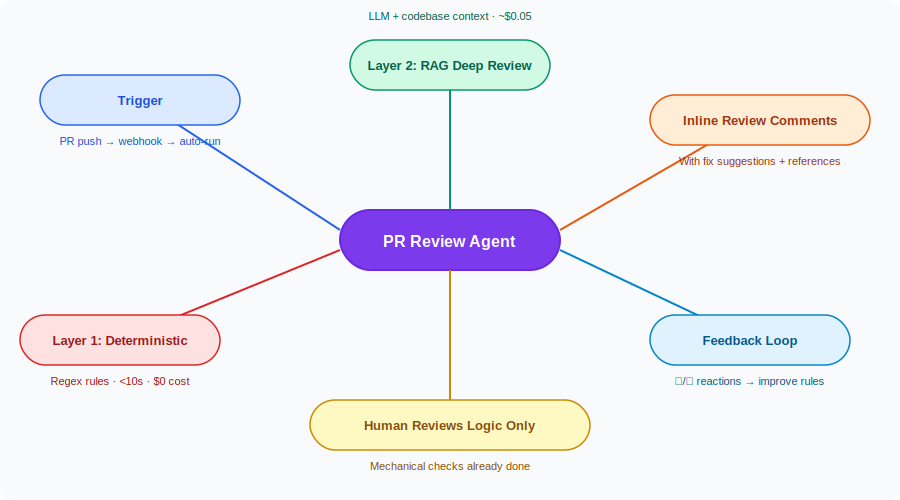
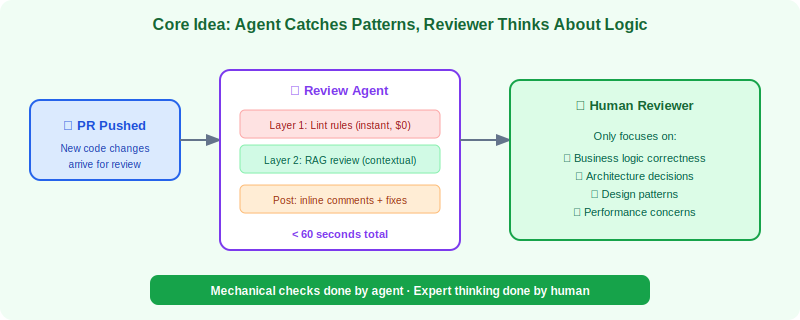
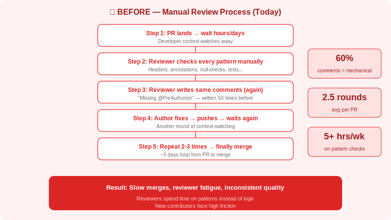
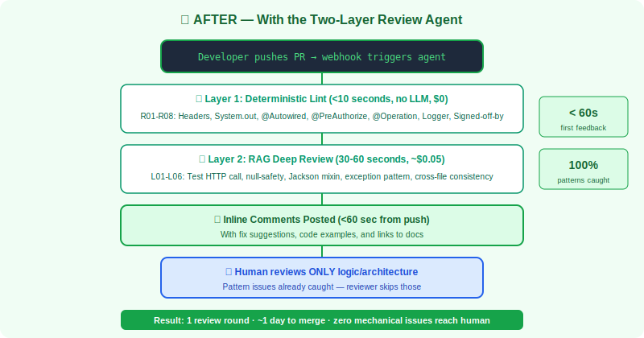
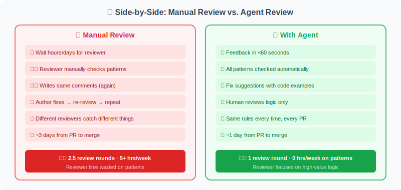
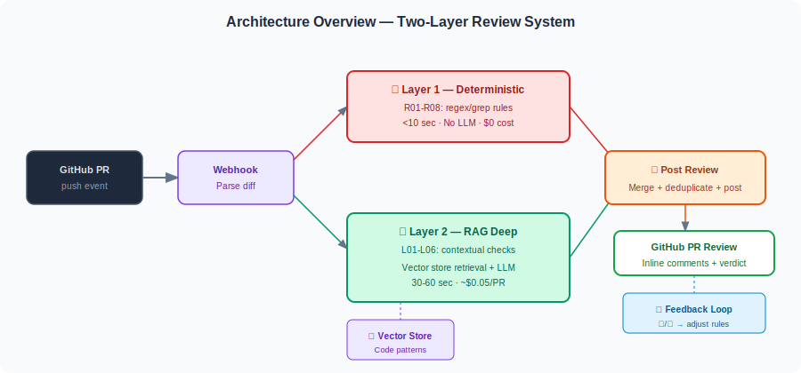
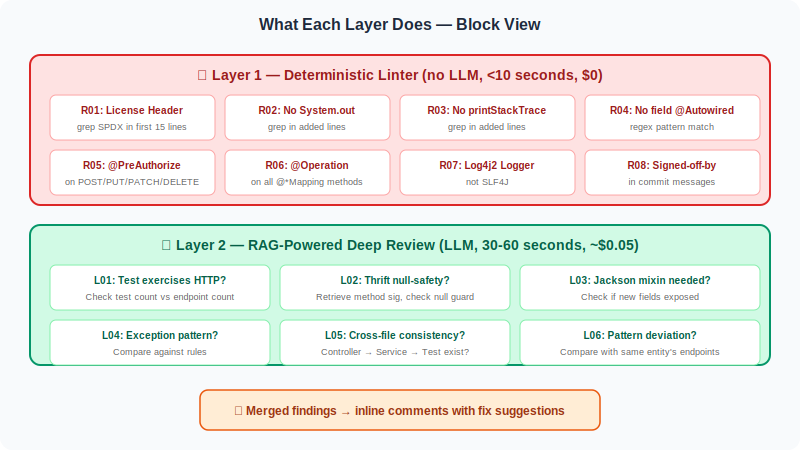
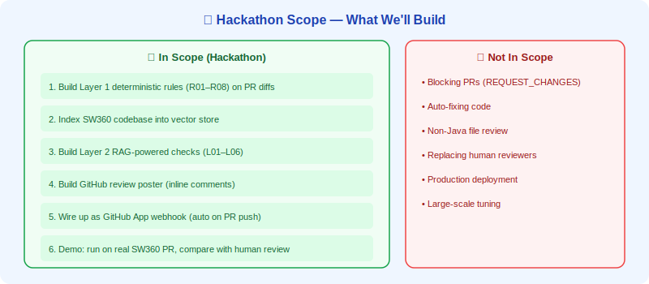
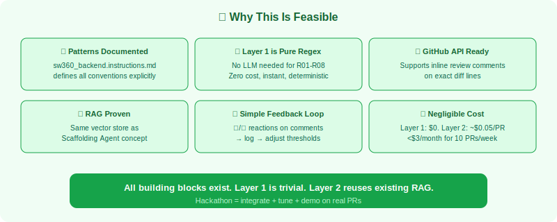

# PR Review Agent

> **Hackathon Proposal · Siemens SW360 · May 2026**

---
## 📌 Idea Title

**Two-Layer Automated PR Review Agent for SW360**

---

## 👥 Hackathon/Event Team Name

**Team ReviewBot**

---
## � Problem Abstract

Code review in SW360 is a critical quality gate, but with 40+ contributors and 10+ PRs per week, human reviewers spend the majority of their time catching **repetitive mechanical pattern violations** — missing license headers, wrong logger usage, absent `@PreAuthorize` annotations, field injection instead of constructor injection. Today, **60% of review comments are these same corrections** repeated across every PR. Feedback arrives hours or days after a push (depending on reviewer availability), resulting in **2.5 review rounds on average** before patterns are correct. Different reviewers catch different issues inconsistently, and new contributors experience 3-4 failed rounds before learning conventions. Reviewers spend ~5 hours/week on mechanical checks alone — 260 hours/year of expert time on work that could be automated — leaving little capacity for the high-value logic and architecture review that only humans can do well.

---

## 📌 Solution Abstract

**PR Review Agent** is a two-layer automated review system that catches all mechanical pattern violations within 60 seconds of a push, so human reviewers can focus entirely on business logic and architecture. **Layer 1** runs deterministic regex/grep rules ($0 cost, instant, 100% accurate) for license headers, prohibited patterns (`System.out.println`, `@Autowired` fields), required annotations, and commit conventions. **Layer 2** uses RAG-powered LLM analysis (~$0.05/PR) for contextual checks: tests exercising HTTP, Thrift null-safety, Jackson mixin needs, and cross-file consistency. Both layers merge findings and post inline GitHub comments with fix suggestions. The result: **first feedback in <60 seconds** instead of hours/days, review rounds drop from 2.5 to 1.0 average, reviewers reclaim 5 hours/week for logic review, and new contributors get clear actionable fixes on first push. Pattern violations never reach the human reviewer.

---

## 📋 Invention Disclosure Questionnaire

---

### 1. Which technical problem is the basis for the invention?

The core technical problem is the **absence of automated, pattern-aware code review** that can handle both deterministic rule violations and contextual cross-file consistency checks in a large enterprise codebase with strict coding conventions.

Specifically:

- SW360 enforces numerous coding patterns (license headers, specific logger usage, annotation requirements, constructor injection, Thrift null-safety) that are currently validated only through human code review.
- Human reviewers are inconsistent: different reviewers catch different issues, and reviewer fatigue leads to pattern violations slipping through.
- Feedback latency is high: PRs wait hours or days for a reviewer, then require 2-3 round-trips to fix mechanical issues before logic review even begins.
- Some checks require cross-file context (if a Thrift method is added, is the Handler updated? If a REST endpoint is added, does the test actually make HTTP calls?) that cannot be expressed as single-file lint rules.
- The existing CI pipeline runs ArchUnit tests that catch some violations, but only after the full PR is pushed and built — providing late, coarse-grained feedback rather than immediate inline suggestions.

The technical problem is therefore: *how to provide instant, comprehensive, context-aware pattern review on PR diffs, combining zero-cost deterministic rules with LLM-powered cross-file analysis, integrated directly into the GitHub review workflow.*

---

### 2. How has this problem been solved up to now?

The problem has not been solved by any dedicated technical mechanism. The current approach is:

- **Pure human review**: Senior engineers manually check each changed file for pattern compliance, annotation presence, and convention adherence.
- **Mental checklists**: Reviewers rely on memory and experience to check patterns; no codified ruleset is enforced at review time.
- **Post-hoc CI enforcement**: ArchUnit and checkstyle catch some violations, but only after full compilation, and without inline PR feedback or fix suggestions.
- **Review fatigue**: The same mechanical comments ("add license header," "use constructor injection") are written repeatedly across PRs, consuming reviewer time and attention.
- **No contextual checks**: There is no automation for cross-file consistency (e.g., ensuring a new Thrift method has a corresponding Handler implementation).

In summary, the problem is currently solved by **human repetition**, with inconsistent coverage and high latency, and no mechanism for context-aware or cross-file pattern validation at PR time.

---

### 3. By which technical features does the invention solve the problem indicated under point 1?

The invention solves the problem through the following technical features:

**a) Two-layer architecture separating deterministic and contextual checks**
Layer 1 uses pure regex/grep-based rules that run in <10 seconds with zero LLM cost and 100% accuracy — catching license headers, prohibited patterns, required annotations, and commit conventions. Layer 2 uses RAG-powered LLM analysis for checks that require context: test HTTP exercise verification, Thrift null-safety, Jackson mixin necessity, and cross-file consistency.

**b) RAG-grounded contextual review**
Layer 2 retrieves relevant code patterns from a vector store index of the SW360 codebase. When checking if a test properly exercises HTTP, the agent retrieves examples of correct tests for comparison. This grounds LLM decisions in actual codebase conventions rather than generic assumptions.

**c) GitHub PR diff integration with inline comments**
The agent extracts only the changed files from the PR diff (ignoring unchanged code), runs both layers, and posts findings as inline GitHub review comments on the exact lines with issues. Each comment includes a suggested fix when applicable.

**d) Automatic trigger on PR push**
The agent runs as a GitHub App webhook that fires within seconds of any push to an open PR. Developers receive feedback before they context-switch away from the code.

**e) Feedback loop for tuning**
Developers can react with 👍/👎 on agent comments. Negative reactions log false positives, allowing rules to be refined over time and reducing noise.

**f) Severity-based review verdict**
Findings are classified as errors (blocking, e.g., missing security annotation) or warnings (suggestions). The agent posts `COMMENT` by default; after tuning, error-severity findings will use `REQUEST_CHANGES` to block merge.

---

### 4. What are the main differences between your invention and the known solutions/products?

| Dimension | Known Approaches | PR Review Agent |
|---|---|---|
| **Check types** | Single-file linters (checkstyle) or pure human review | Two-layer: deterministic rules + RAG-powered contextual checks |
| **Cross-file consistency** | Not automated; relies on human review | Layer 2 checks: Thrift ↔ Handler, Controller ↔ Test, fields ↔ Jackson mixin |
| **Feedback latency** | Hours/days (human) or post-build (CI) | <60 seconds (webhook-triggered) |
| **Cost model** | Human time ($$$) or CI compute ($) | Layer 1: $0. Layer 2: ~$0.05/PR |
| **Fix suggestions** | Rarely provided by tools | Every comment includes fix suggestion when applicable |
| **Grounding** | Generic lint rules | RAG retrieval from actual codebase patterns |
| **Integration** | Separate tool output (logs, reports) | Inline GitHub PR comments on exact lines |
| **Feedback loop** | None | 👍/👎 reactions tune rule sensitivity |
| **Consistency** | Varies by reviewer | Same rules, every PR, every time |

No existing tool was identified that combines zero-cost deterministic linting, RAG-powered contextual cross-file checks, and inline GitHub PR integration with feedback-driven tuning for enterprise Java codebases.

---

### 5. Detection

The invention is **detectable by use**. Specifically:

- Review comments posted by the agent are identifiable by the GitHub App identity (e.g., "PR Review Agent" bot account).
- The agent's review verdict (`COMMENT` or `REQUEST_CHANGES`) and comment content are visible in the PR history.
- Layer 2 RAG retrieval logs record which codebase patterns were used to evaluate each PR file.
- The GitHub webhook trigger events are logged by GitHub and by the agent's hosting platform.
- False positive logs (from 👎 reactions) are stored and auditable.

Detection is therefore possible through GitHub PR history, webhook logs, and agent-side audit trails.

---

### 6. Invention Disclosures or Closely Related Siemens Patent Applications

To the best of the inventors' knowledge at the time of this disclosure:

- No prior Siemens invention disclosure specifically covering **two-layer automated PR review combining deterministic rules and RAG-powered contextual analysis with inline GitHub integration** has been identified.
- No Siemens patent application covering the specific combination of: (a) zero-cost regex-based Layer 1 linting, (b) RAG-grounded LLM-powered Layer 2 cross-file checks, (c) inline GitHub PR comment posting with fix suggestions, and (d) feedback-driven rule tuning via reactions, has been identified in publicly available Siemens patent databases.
- Related general areas (code review automation, static analysis, LLM tooling) should be searched by the patent department prior to filing to confirm novelty.

> *This section should be reviewed and confirmed by the Siemens IP/Patent department before formal submission.*

---

## �💡 Idea Introduction

Code review in SW360 is a **critical quality gate** — every PR must pass pattern checks, security conventions, and architectural rules before merging. With **40+ contributors** of varying experience levels, human reviewers spend the majority of their review time catching the same mechanical issues over and over again.

Today, **60% of review comments are repetitive pattern corrections** — missing license headers, wrong logger usage, absent `@PreAuthorize` annotations — leaving little time for the high-value logic and architecture review that only humans can do well.

This project introduces a **Two-Layer PR Review Agent** that automatically catches all mechanical pattern violations within 60 seconds of a push, so human reviewers can focus entirely on business logic, architecture, and design decisions.

---

## 🗺️ Idea Mind Map



---

## ❓ Why This Matters — The Problem


### What the reviewers do today

```
1.  PR lands
    └── Wait hours/days for reviewer to pick it up

2.  Reviewer opens each changed file
    └── Check: license header present?
    └── Check: no System.out.println?
    └── Check: no field @Autowired? (must be constructor injection)
    └── Check: write endpoints have @PreAuthorize?
    └── Check: all endpoints have @Operation?
    └── Check: Thrift return values null-checked?
    └── Check: exception handling uses SW360Exception pattern?
    └── Check: test actually calls TestRestTemplate? (ArchUnit)
    └── Check: Jackson mixin updated if new fields?

3.  Reviewer writes comments
    └── Often the same comments they wrote on the last 5 PRs
    └── Different reviewers catch different things

4.  Author fixes, pushes, requests re-review
    └── Repeat 2-3 times until patterns are correct

5.  Merge
```

### Why this is painful

| Pain point | Impact |
|---|---|
| **60% of review comments are mechanical** | Reviewer fatigue; no time for logic review |
| **2.5 review rounds on average** | Slow merge velocity |
| **Hours/days to first feedback** | Developer context-switches away |
| **Inconsistent across reviewers** | Person A catches security, Person B misses it |
| **New contributors fail 3-4 times** | Discouraging; high onboarding friction |

> 💡 **Real-world scale:** With 40+ contributors and 10+ PRs per week, reviewers spend **~5 hours/week** on mechanical pattern checks alone. That's 260 hours/year of expert time spent on work a machine can do instantly.

---

## 🎯 Core Idea — What It Solves

> The core idea is simple: **let the agent catch the patterns, so the reviewer can think about the logic.**



The agent splits review into two layers: **deterministic lint rules** (instant, zero-cost, 100% accurate) and **RAG-powered contextual checks** (cross-file consistency, pattern matching against the real codebase). Both run automatically on every PR within 60 seconds.

---

## 🔄 Before & After — The Full Picture

> These diagrams show what PR review looks like **without** the agent (today) and **with** the agent.

### ❌ BEFORE — The Manual Way (Today)



> **Result today:** Hours to first feedback, inconsistent checks depending on who reviews, 2-3 rounds of mechanical fixes before logic review even begins.

### ✅ AFTER — With the Two-Layer Review Agent



> **Result with agent:** Mechanical feedback in <60 seconds. Human reviewer only sees pattern-clean code and can focus on logic, architecture, and design.

### 📊 Side-by-Side at a Glance



| Step | ❌ Manual Today | ✅ With PR Review Agent |
|------|----------------|------------------------|
| **1** | Wait hours/days for reviewer | Feedback in <60 seconds |
| **2** | Reviewer checks headers, annotations, patterns | Agent catches all mechanical issues instantly |
| **3** | Reviewer writes repetitive comments | Agent posts inline comments with fix suggestions |
| **4** | Author fixes → re-review → fixes → re-review | Author fixes once → human reviews logic only |
| **5** | Human reviews logic + patterns mixed together | Human reviews only logic/architecture |
| **6** | Merge after 2-3 rounds | Merge after 1 round |

---

## 🏢 Value for Siemens

| Metric | 🔴 Without Agent | 🟢 With PR Review Agent | 💡 Impact |
|---|---|---|---|
| ⏱️ **Time to first feedback** | Hours to days | < 60 seconds | **Instant developer unblocking** |
| 🔁 **Review rounds** | 2.5 average | 1.0 average | **60% fewer cycles** |
| 🧠 **Reviewer time on patterns** | ~5 hrs/week | ~0 hrs/week | **260 hrs/year freed for logic review** |
| 🎯 **Pattern checks caught** | Depends on reviewer attention | 100% (deterministic rules) | Zero mechanical issues reach human |
| 📏 **Consistency across PRs** | Varies by reviewer | Same rules every time | Predictable quality |
| 🆕 **New contributor experience** | 3-4 failed rounds before learning | First push gets clear, actionable fixes | Lower onboarding friction |
| 💰 **Cost per PR** | Senior engineer hours | $0.05 (Layer 2 LLM cost) | Orders of magnitude cheaper |
| 📈 **Merge velocity** | ~3 days per PR | ~1 day per PR | Faster feature delivery |

---

## 📐 Proposal Overview — Solution Approach

### The Big Picture — How the Two Layers Connect



### What Each Layer Does — Block View



The approach splits at the **cost/accuracy boundary**:

- ⚡ **Layer 1 — Deterministic Linter** — regex/grep rules, instant, zero cost, 100% accurate
- 🧠 **Layer 2 — RAG Deep Review** — LLM-powered, contextual, grounded in codebase patterns
- 📝 **Post Review** — merges findings, deduplicates, posts inline GitHub comments

### The Two-Layer Workflow in Detail

```
┌──────────────────────────────────────────────────────────────────────┐
│  LAYER 1 — DETERMINISTIC LINTER (< 10 seconds, no LLM)              │
│                                                                      │
│  • R01: License header on new files                                  │
│  • R02: No System.out.println                                        │
│  • R03: No e.printStackTrace()                                       │
│  • R04: No @Autowired on fields                                      │
│  • R05: @PreAuthorize on write endpoints                             │
│  • R06: @Operation on endpoint methods                               │
│  • R07: Logger uses LogManager.getLogger() (not SLF4J)               │
│  • R08: Commits have Signed-off-by                                   │
└──────────────────────────────────────────────────────────────────────┘
                              │
              ╔═══════════════▼══════════════════╗
              ║   LAYER 2 — RAG DEEP REVIEW      ║
              ║   (contextual, grounded in code)  ║
              ║                                   ║
              ║  • L01: Test exercises HTTP?       ║
              ║  • L02: Thrift null-safety?        ║
              ║  • L03: Jackson mixin needed?      ║
              ║  • L04: Exception pattern correct? ║
              ║  • L05: Cross-file consistency?    ║
              ║  • L06: Reference pattern match?   ║
              ╚═══════════════╤══════════════════╝
                              │
┌──────────────────────────────────────────────────────────────────────┐
│  POST REVIEW                                                         │
│                                                                      │
│  • Merges findings from both layers                                  │
│  • Deduplicates overlapping issues                                   │
│  • Posts inline comments with fix suggestions                        │
│  • Verdict: REQUEST_CHANGES (errors) or COMMENT (warnings only)      │
└──────────────────────────────────────────────────────────────────────┘
```

---

## 🏁 Hackathon Scope

> 💡 **This is a proposal idea. No technical work has been started yet.** The hackathon goal is to validate the concept, build a working prototype, and demonstrate it on a real SW360 PR.



**What this proposal asks for (Hackathon):**

| # | Goal | Status |
|---|---|---|
| 1 | Build Layer 1 deterministic rules (R01–R08) on PR diffs | 🔲 Not started |
| 2 | Index the SW360 codebase into vector store (patterns, rules, conventions) | 🔲 Not started |
| 3 | Build Layer 2 RAG-powered checks (L01–L06) | 🔲 Not started |
| 4 | Build the GitHub review poster (inline comments with suggestions) | 🔲 Not started |
| 5 | Wire up as GitHub App webhook (auto-trigger on PR push) | 🔲 Not started |
| 6 | Demo: run on a real SW360 PR and compare against human review | 🔲 Not started |

**What is explicitly NOT in scope for the hackathon:**
- ❌ Production deployment or blocking PRs (`REQUEST_CHANGES`)
- ❌ Auto-fixing code (only suggestions)
- ❌ Reviewing non-Java files (docs, configs, scripts)
- ❌ Replacing human reviewers for logic/architecture decisions

---

## ✅ Why This Is Feasible



| Factor | Evidence |
|---|---|
| **SW360 patterns are well-documented** | `sw360_backend.instructions.md` defines all conventions explicitly |
| **Layer 1 rules are pure regex/grep** | No LLM needed; zero cost, instant, deterministic |
| **GitHub API supports inline review comments** | Agent can post on exact diff lines with suggestions |
| **RAG retrieval works for code patterns** | Proven in Scaffolding Agent concept; same vector store |
| **Feedback loop is simple** | 👍/👎 reactions on comments → log → adjust thresholds |
| **Cost is negligible** | Layer 1: $0. Layer 2: ~$0.05/PR. Total: <$3/month for 10 PRs/week |

---

## ❓ Q&A

**Q: Will the agent block my PR?**
Not by default. It posts as `COMMENT`. After tuning (when false positive rate <5%), error-severity findings will use `REQUEST_CHANGES`.

**Q: What if it flags something incorrectly?**
React with 👎 on the comment. This logs a false positive. The agent will learn to be less aggressive on that rule for similar code patterns.

**Q: Does it replace human reviewers?**
No. It handles the 60% of review comments that are mechanical pattern checks. Human reviewers can focus entirely on business logic, architecture, and design decisions.

**Q: How fast is it?**
Layer 1: <10 seconds. Layer 2: 30-60 seconds (depends on number of changed files). Total: first feedback within 60 seconds of push.

**Q: Does it check every file in the PR?**
Only changed `.java` files. It skips: test resources, config files, documentation, generated code.

**Q: What about PRs that change Thrift definitions?**
Layer 2 (L05) will check: if a Thrift method is added, is the Handler also updated? If a field is added to an entity, is the DatabaseHandler updated?

**Q: Can I disable specific rules?**
Yes. In `config.yml`, set `rules: [R01, R02, ...]` to only the ones you want active.

**Q: How much does it cost per PR?**
Layer 1: $0 (no LLM). Layer 2: ~$0.05 per PR (GPT-4o, typically 3-5 changed files × 1 LLM call each).

**Q: Is the human review changed at all?**
No. The human reviewer still reviews the PR as normal. The only difference is they see pattern issues already flagged, so they can skip checking those and focus on logic.

---

