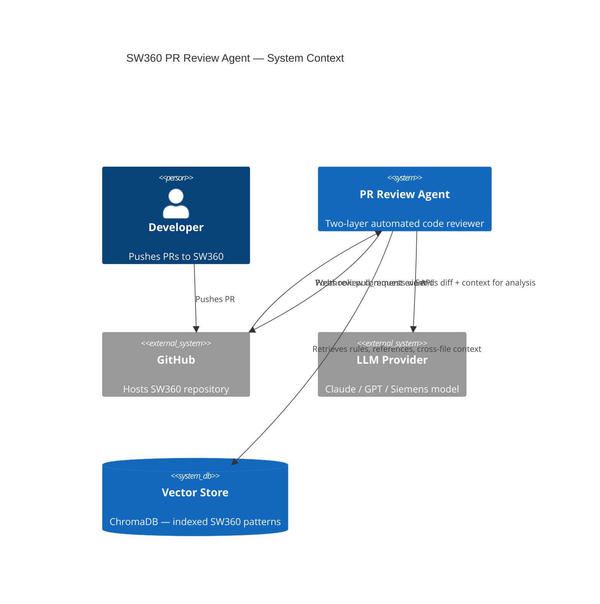
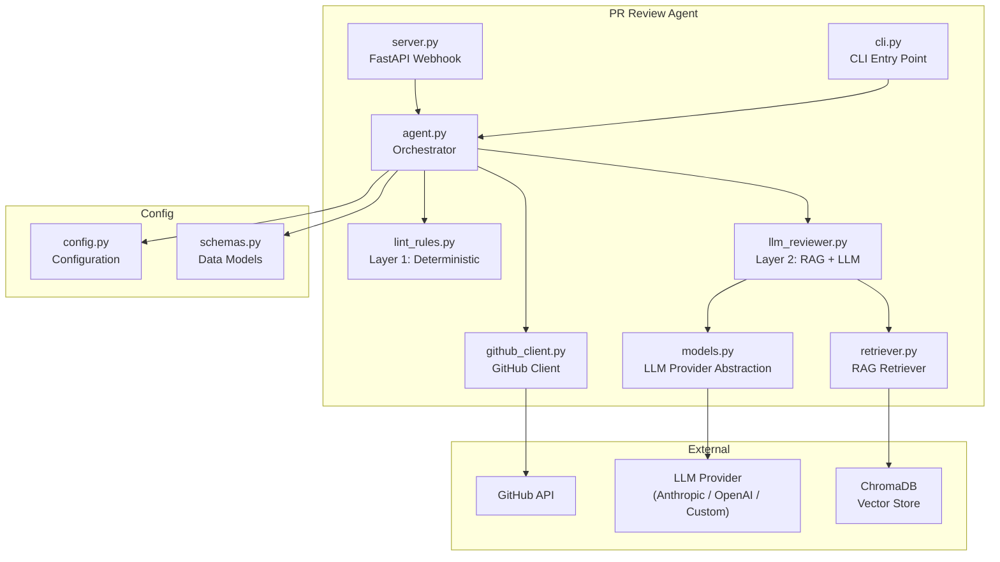
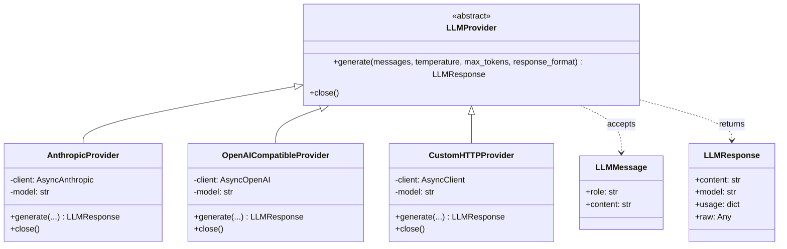
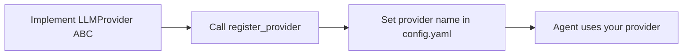
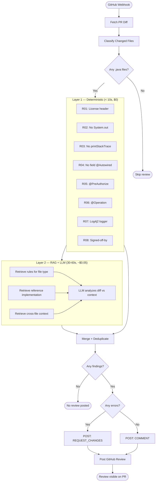
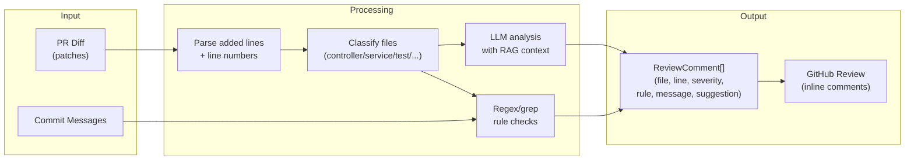
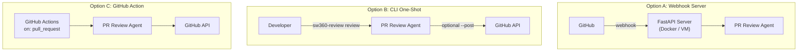

# PR Review Agent — Architecture

> Technical architecture of the Two-Layer PR Review Agent.

## System Overview

## Component Architecture

## Model Provider Abstraction

The key extensibility point — swap models without code changes.

### Adding a New Provider

## Review Pipeline

## Data Flow

## Deployment Options

## Technology Stack

| Component | Technology | Purpose |
|-----------|-----------|---------|
| Language | Python 3.11+ | Async-first, rich ecosystem |
| Web Framework | FastAPI | Webhook receiver |
| LLM (default) | Claude Opus 4.5/4.6 | Contextual code analysis |
| Vector Store | ChromaDB | RAG retrieval |
| HTTP Client | httpx | Async GitHub API calls |
| Config | Pydantic + YAML | Type-safe configuration |
| Logging | structlog | Structured JSON logging |
| Testing | pytest + pytest-asyncio | Unit & integration tests |
