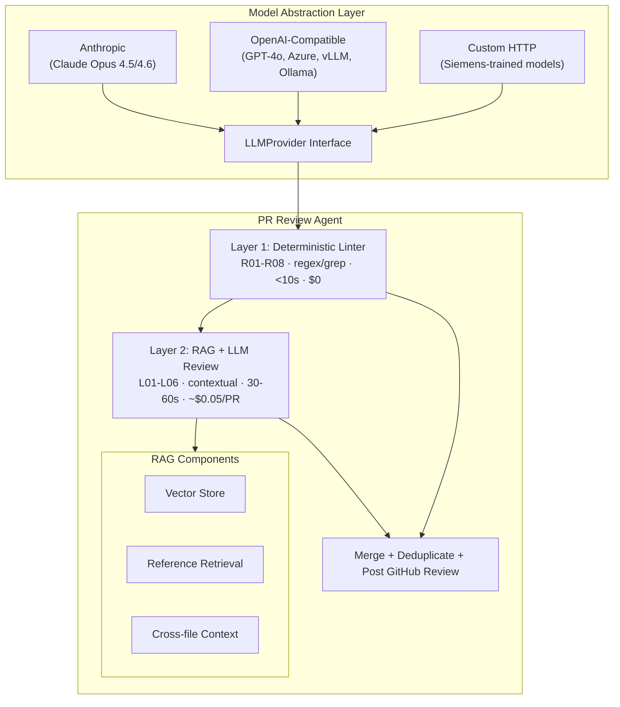
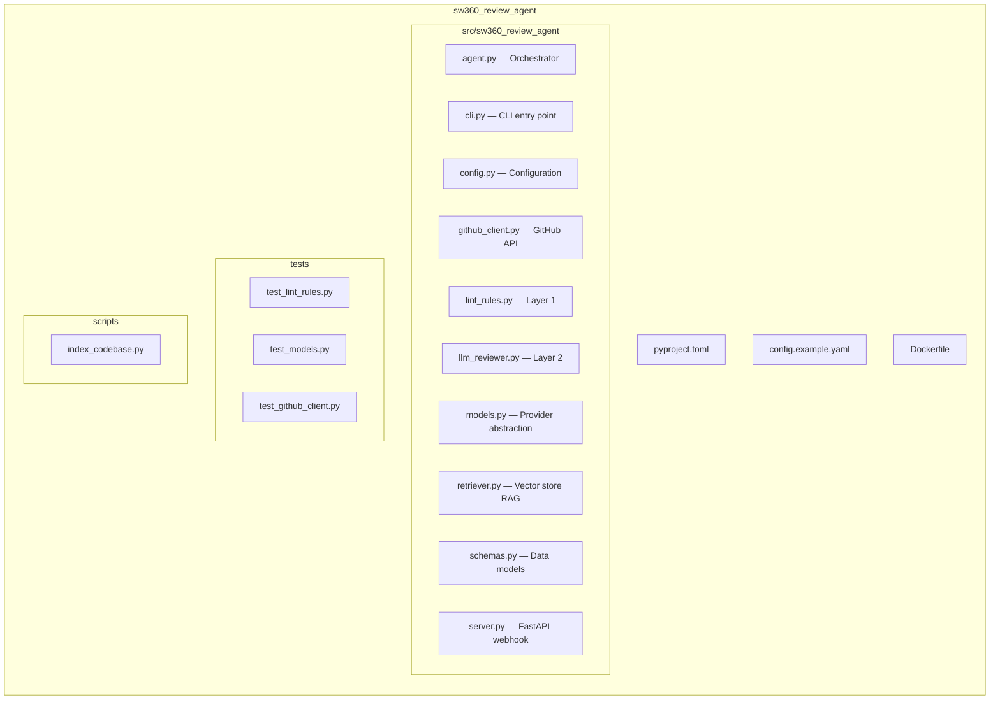
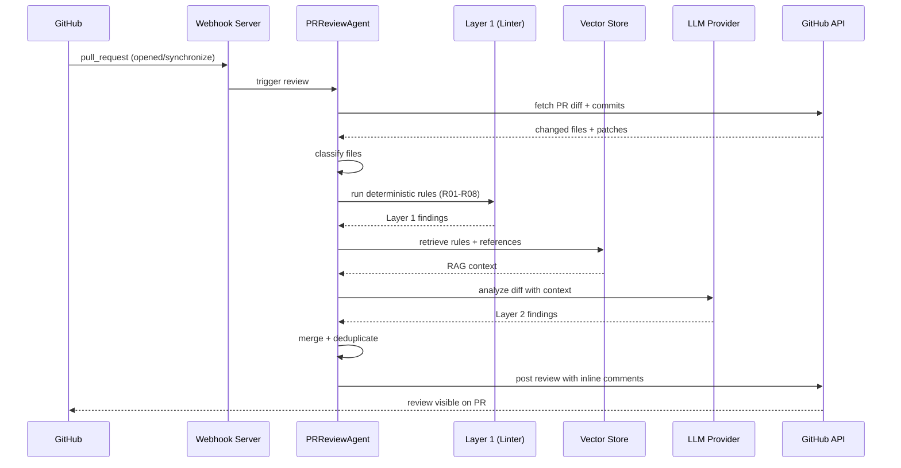

# SW360 PR Review Agent

> **Two-Layer Automated PR Review Agent** — catches mechanical pattern violations instantly so human reviewers can focus on logic.

## Architecture



## Quick Start

### 1. Install

```bash
cd pr_review_agent/sw360_review_agent
pip install -e ".[dev]"
```

### 2. Configure

```bash
cp config.example.yaml config.yaml
# Edit config.yaml with your settings
```

Set environment variables:
```bash
export GITHUB_TOKEN="ghp_your_github_token"
export ANTHROPIC_API_KEY="sk-ant-your-key"  # Or OPENAI_API_KEY for OpenAI
```

### 3. Run

```bash
# Review a specific PR (dry run — prints results, does not post)
sw360-review review --repo eclipse-sw360/sw360 --pr 142

# Review and post to GitHub
sw360-review review --repo eclipse-sw360/sw360 --pr 142 --post

# Run Layer 1 lint on a local file
sw360-review lint --file src/main/java/MyController.java

# Start webhook server
sw360-review server
```

## Model Configuration

The agent is **model-agnostic** by design. Switch models by changing `config.yaml`:

### Claude (Anthropic) — Default

```yaml
model:
  provider: "anthropic"
  model_name: "claude-sonnet-4-20250514"  # or claude-opus-4-20250514
```

### OpenAI / Azure

```yaml
model:
  provider: "openai"
  model_name: "gpt-4o"
  # For Azure:
  # base_url: "https://your-deployment.openai.azure.com/openai/deployments/gpt-4o/v1"
  # api_key: "your-azure-key"
```

### Siemens-Trained Models (or any custom endpoint)

```yaml
model:
  provider: "openai"  # If your model exposes OpenAI-compatible API
  model_name: "siemens-codellm-v2"
  base_url: "https://your-internal-model.siemens.cloud/v1"
  api_key: "your-internal-key"
```

Or for fully custom endpoint formats:

```yaml
model:
  provider: "custom"
  model_name: "siemens-codellm-v2"
  base_url: "https://your-internal-model.siemens.cloud"
  api_key: "your-internal-key"
```

### Adding a New Provider Programmatically

```python
from sw360_review_agent.models import LLMProvider, LLMMessage, LLMResponse, register_provider

class SiemensLLMProvider(LLMProvider):
    async def generate(self, messages, **kwargs) -> LLMResponse:
        # Your custom implementation
        ...

    async def close(self):
        ...

# Register before creating the agent
register_provider("siemens_llm", SiemensLLMProvider)
```

Then in config:
```yaml
model:
  provider: "siemens_llm"
  model_name: "your-model"
```

## Layer 1 Rules (Deterministic)

These rules **complement** ArchUnit (78 tests) and CI — they catch what those tools miss.

| Rule | Check | Severity |
|------|-------|----------|
| R01 | Commits have Signed-off-by (DCO/ECA) | error |
| R02 | Thrift client return values null-checked | warning |
| R03 | No hardcoded credentials/secrets | error |
| R04 | Unbounded collection fetch (missing pagination) | warning |
| R05 | New Thrift fields need CouchDB migration script | warning |
| R06 | No `catch(Exception)` — use specific types | warning |

> **Note:** License headers, System.out, @Autowired, @PreAuthorize, @Operation, and LoggerFactory
> are already enforced by ArchUnit and CI. We don't duplicate those checks.

## Layer 2 Checks (AI-Powered)

Expert-level contextual analysis using RAG + LLM. Each file gets a **file-type-specific** review
(controller, service, handler, test, thrift) with tailored focus areas.

### REST API Layer
| Check | What it verifies |
|-------|-----------------|
| L01 | API backward compatibility — no breaking field/endpoint changes |
| L02 | JacksonCustomizations dual registration (ObjectMapper + SpringDoc) |
| L03 | HATEOAS/HAL responses — EntityModel, links, pagination format |

### Service & Thrift Layer
| Check | What it verifies |
|-------|-----------------|
| L04 | Thrift return values null-checked before use |
| L05 | Exception handling chain (SW360Exception → HTTP exceptions) |
| L06 | Cross-file consistency (Thrift → Handler → Service → Test) |

### Database & CouchDB Layer
| Check | What it verifies |
|-------|-----------------|
| L07 | CouchDB query efficiency — N+1 patterns, missing indexes |
| L08 | Pagination correctness — DB-side via PaginationData, not in-memory |
| L09 | CouchDB view design — type filters, reduce functions |

### Testing & Security
| Check | What it verifies |
|-------|-----------------|
| L10 | Test quality — real HTTP calls, meaningful assertions, error cases |
| L11 | Document-level permission checks — makePermission, isUserAtLeast |
| L12 | Resource management — stream/transport cleanup, no static mutability |

## Project Structure



## Development

```bash
# Install with dev dependencies
pip install -e ".[dev]"

# Run tests
pytest

# Type checking
mypy src/

# Lint
ruff check src/
```

## How It Works



## Design Decisions

| Decision | Rationale |
|----------|-----------|
| **Provider abstraction** | Swap Claude/GPT/Siemens models with config change only |
| **Two-layer split** | Layer 1 is free+instant; Layer 2 only for what regex can't catch |
| **Sequential pipeline** | LLM is called once per file, not in a loop — predictable costs |
| **Graceful degradation** | If Layer 2 fails, Layer 1 still posts results |
| **50-comment cap** | GitHub API limit; errors prioritized over warnings |
