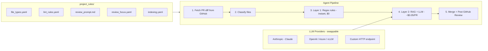

# PR Review Agent

> **Project-Agnostic Two-Layer Automated PR Review Agent** — catches mechanical pattern violations instantly so human reviewers can focus on logic. Works with **any project** via configurable rules.

## How It Works



## Quick Start

### 1. Install

```bash
cd pr_review_agent/sw360_review_agent
pip install -e ".[dev]"
```

### 2. Configure

```bash
cp config.example.yaml config.yaml
# Edit config.yaml with your settings
```

Set environment variables:
```bash
export GITHUB_TOKEN="ghp_your_github_token"
export ANTHROPIC_API_KEY="sk-ant-your-key"  # Or OPENAI_API_KEY for OpenAI
```

### 3. Run

```bash
# Review a specific PR (dry run — prints results, does not post)
sw360-review review --repo eclipse-sw360/sw360 --pr 142

# Review and post to GitHub
sw360-review review --repo eclipse-sw360/sw360 --pr 142 --post

# Run Layer 1 lint on a local file
sw360-review lint --file src/main/java/MyController.java

# Start webhook server
sw360-review server
```

---

## Layer 1 Rules (Deterministic)

Layer 1 rules are **regex-based checks** that run instantly with zero cost. They catch common violations that automated CI tools miss.

### Where to configure

```
project_rules/lint_rules.yaml
```

### How it works

Each rule defines:
- **id** — unique identifier (used in `config.yaml` to enable/disable)
- **type** — `commit` (checks commit messages) or `file` (checks source lines)
- **patterns** — regex patterns that indicate a violation
- **applies_to** — which file types this rule applies to (from `file_types.yaml`)
- **exclude_paths** — skip files containing these path fragments

### Enable/disable rules in `config.yaml`

```yaml
layer1:
  enabled: true
  rules: [R01, R02, R03, R06]   # only enable the rules you want
```

### Sample: Adding a custom rule

To add a rule that catches `console.log` in TypeScript production code:

```yaml
# In project_rules/lint_rules.yaml
rules:
  - id: R10
    name: "Console log in production"
    type: file
    severity: warning
    patterns:
      - regex: 'console\.(log|debug|info)\('
        label: "console.log"
    exclude_paths: [".spec.", ".test.", "__tests__"]
    applies_to: [typescript, component]
    message: "console.log found in production code."
    suggestion: "Remove or replace with a proper logging service."
```

### Sample: Commit-level rule

```yaml
  - id: R01
    name: "Signed-off-by (DCO)"
    type: commit
    severity: error
    match_type: must_contain
    pattern: "Signed-off-by:"
    message: "Commit missing 'Signed-off-by:' line."
    suggestion: "Use git commit -s to add it automatically."
```

### Rule type reference

| Field | Values | Description |
|-------|--------|-------------|
| `type` | `commit`, `file` | What to check |
| `severity` | `error`, `warning`, `suggestion` | How critical |
| `match_type` | `must_contain`, `must_not_match` | For commit rules |
| `applies_to` | list of file types | Scope (omit = all files) |
| `exclude_paths` | list of strings | Skip paths containing these |
| `only_modified` | `true`/`false` | Only check modified files (not new) |

---

## Layer 2 Checks (AI-Powered)

Layer 2 uses an LLM with RAG context to perform **expert-level code review** — things regex cannot catch (architectural violations, cross-file consistency, logic errors).

### Where to configure

| File | Purpose |
|------|---------|
| `project_rules/review_prompt.md` | System prompt — describe your architecture here |
| `project_rules/review_focus.yaml` | Per-file-type instructions + rule definitions |

### How it works

1. The agent loads your **system prompt** (`review_prompt.md`) which tells the LLM about your project architecture
2. For each changed file, it loads the **focus prompt** matching the file type (from `review_focus.yaml`)
3. RAG retrieves relevant reference patterns from the indexed codebase
4. The LLM analyzes the diff against rules + context and returns findings as JSON

### Enable/disable checks in `config.yaml`

```yaml
layer2:
  enabled: true
  checks: [L01, L04, L05, L06, L10]   # pick the checks relevant to your project
```

### Sample: Defining review rules (`review_focus.yaml`)

```yaml
# Define what the LLM should check
rules:
  - id: L01
    name: "API backward compatibility"
    description: >
      Detect breaking REST API changes: field removal from responses,
      type changes, endpoint path/method changes. These break clients.

  - id: L04
    name: "External call null-safety"
    description: >
      Every external service call can return null or fail.
      Callers MUST null-check before using the result.

# Define file-type-specific focus
focus:
  controller: |
    ## Review Focus: Controller
    You are reviewing an API Controller. Focus on:
    1. L01: Are any response fields removed or renamed?
    2. L06: Is there a matching test for new endpoints?
    3. L11: Do write endpoints check permissions?

  service: |
    ## Review Focus: Service Layer
    You are reviewing a Service class. Focus on:
    1. L04: Is every external call null-checked?
    2. L05: Are exceptions caught and mapped properly?
```

### Sample: Custom system prompt (`review_prompt.md`)

```markdown
You are an expert code reviewer for our Django REST API project.

## Architecture
Controllers (views.py) → Services → Repositories → PostgreSQL

## Response Format
Return ONLY a JSON array of findings.

## Constraints
- Only report issues you are 80%+ confident about
- Every finding must cite a specific line number
- Provide actionable fix suggestions
```

---

## File Type Classification

Controls how the agent identifies file types from paths.

### Where to configure

```
project_rules/file_types.yaml
```

### Sample

```yaml
patterns:
  - pattern: ".*Controller\\.java$"
    type: controller

  - pattern: ".*\\.spec\\.ts$"
    type: test

  - pattern: ".*\\.py$"
    type: python
```

First match wins. Unmatched files get type `other` and are skipped.

---

## RAG Indexing

Controls what codebase content is indexed into the vector store for reference retrieval.

### Where to configure

```
project_rules/indexing.yaml
```

### Run the indexer

```bash
python scripts/index_codebase.py --repo-path /path/to/your/project --rules-dir ./project_rules
```

### Sample

```yaml
project_name: "my-project"
scan_dirs:
  - path: "src/controllers"
    include_patterns: ["**/*Controller.java"]
  - path: "src/services"
    include_patterns: ["**/*Service.java"]
file_matchers:
  controller:
    suffix: "Controller.java"
    exclude_suffix: "Test.java"
extraction_mode: "signatures"     # "signatures" or "full"
max_doc_length: 1500
references_dir: "project_rules/references"   # drop example files here
```

---

## Model Configuration

The agent is **model-agnostic**. Switch providers by editing `config.yaml`:

```yaml
# Anthropic (default)
model:
  provider: "anthropic"
  model_name: "claude-sonnet-4-20250514"

# OpenAI / Azure
model:
  provider: "openai"
  model_name: "gpt-4o"

# Any OpenAI-compatible endpoint (vLLM, Ollama, Siemens internal)
model:
  provider: "openai"
  model_name: "your-model-name"
  base_url: "https://your-endpoint.com/v1"
  api_key: "your-key"
```

---

## Project Structure

```
sw360_review_agent/
├── project_rules/              <-- All project-specific config lives here
│   ├── file_types.yaml         File classification patterns
│   ├── lint_rules.yaml         Layer 1 regex rules
│   ├── review_prompt.md        Layer 2 system prompt
│   ├── review_focus.yaml       Layer 2 rules + per-file-type focus
│   ├── indexing.yaml           RAG indexing configuration
│   └── references/             Drop reference files for RAG here
├── src/sw360_review_agent/     Source code
│   ├── agent.py                Orchestrator
│   ├── config.py               Settings (pydantic)
│   ├── github_client.py        GitHub API integration
│   ├── lint_rules.py           Layer 1 engine
│   ├── llm_reviewer.py         Layer 2 engine
│   ├── models.py               LLM provider abstraction
│   ├── retriever.py            ChromaDB RAG retriever
│   ├── rules_loader.py         YAML/MD config loader
│   ├── schemas.py              Data models
│   └── server.py               FastAPI webhook server
├── scripts/
│   ├── index_codebase.py       Index project into ChromaDB
│   └── test_config_rules.py    Smoke test for config rules
├── tests/                      Unit tests
├── config.example.yaml         Template configuration
└── pyproject.toml              Package definition
```

---

## Development

```bash
# Install with dev dependencies
pip install -e ".[dev]"

# Run tests
pytest

# Type checking
mypy src/

# Lint
ruff check src/
```

---

## Design Decisions

| Decision | Rationale |
|----------|-----------|
| **Project-agnostic** | Works with any project via `project_rules/` — no code changes |
| **Provider abstraction** | Swap Claude/GPT/custom models with config change only |
| **Two-layer split** | Layer 1 is free and instant; Layer 2 only for what regex can't catch |
| **Config-driven rules** | YAML/Markdown — non-programmers can add or modify rules |
| **Sequential pipeline** | LLM called once per file — predictable costs |
| **Graceful degradation** | If Layer 2 fails, Layer 1 results still get posted |
| **50-comment cap** | GitHub API limit; errors are prioritized over warnings |

---

## Adapting for Your Project

1. Copy `project_rules/` into your project
2. Edit each YAML file to match your conventions (see sections above)
3. Set `project_rules_dir` in `config.yaml` to point to your rules directory
4. Run `scripts/index_codebase.py` to build the RAG index
5. Start reviewing PRs

Each config file includes inline comments and examples for Python, TypeScript, and Go projects.
